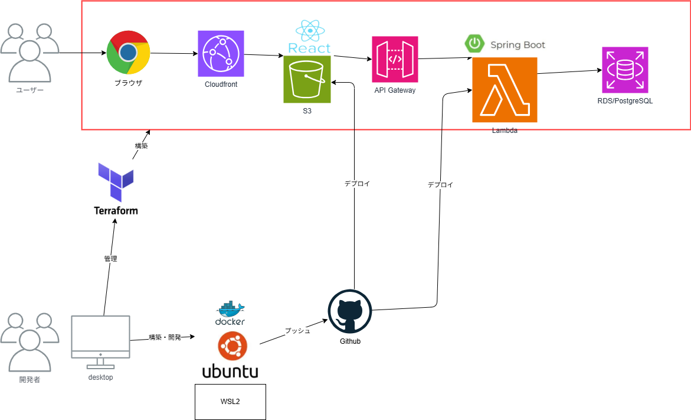

# Musicflows方針設計書

## プロジェクト概要

Musicflows は、ブラウザ上で音楽を打ち込み形式で作成できる Web アプリです。

既存の DAW（Digital Audio Workstation）は多機能である一方、初心者にとっては操作が難しく、作曲を始めるまでのハードルが高いという課題があります。

本プロジェクトでは、　従来のDAW機能をシンプルにし直感的な UI を使って、メロディ・リズム・コードを感覚的に作成できるアプリを目指します。

## 機能一覧

| 機能名               | 説明                                                         |
| :------------------- | :----------------------------------------------------------- |
| ユーザー認証         | ログイン、ログアウトを行う                                   |
| プロジェクト管理     | 作成中の楽曲プロジェクトを作成・編集・削除・一覧表示する     |
| トラック管理         | メロディ、ドラム、コードなどのトラックを追加・編集・削除する |
| ステップシーケンサー | グリッド上に音を配置してリズムやメロディを作成する           |
| ピアノロール         | 音程と時間軸を使ってメロディを入力・編集する                 |
| BPM設定              | 楽曲のテンポを変更する                                       |
| 再生・停止           | 作成したパターンや楽曲をブラウザ上で再生・停止する           |
| 音源選択             | シンセ、ドラム、ベースなどの音色を選択する                   |
| ミキサー             | トラックごとの音量、パン、ミュート、ソロを調整する           |
| エフェクト           | リバーブ、ディレイ、フィルターなどの音響効果を設定する       |
| 楽曲保存             | 作成した楽曲データを保存する                                 |
| 楽曲読み込み         | 保存済みの楽曲データを読み込む                               |
| ファイル保存         | 音源ファイルやエクスポートファイルを保存する                 |

## システム構成

- 開発環境としては Windows 上に WSL2 / Ubuntu を構築し、その上で Docker を利用する
  - 開発者の PC 環境に依存せず、Linux ベースの実行環境に近い状態で開発できるようにする
- バージョン管理、タスク管理、CI/CD は GitHub を中心に行う。
- ソースコード、Issue、Pull Request、GitHub Actions を利用し、開発履歴や作業状況を一元管理する。
- インフラはTerraformで管理する
  - AWS リソースを手作業で作成するのではなく、コードとして管理することで、環境の再現性、変更履歴の管理、構成差分の確認をしやすくする。

## フォルダ構成

### ドキュメント

- **①要件**：システムの方針、大枠を定義する
  - **開発環境構築手順**：開発環境の構築手順が記載されている [リンク先](./①要件/開発環境構築手順/Readme.md)
  - **ノウハウ**：構築系の作業、ツールの操作系、タスクでつまったときの対応方法などをExcelとしてまとめた資料を格納
- **ルール**：PJで守るべきルールが格納されている[リンク先](./ルール/Readme.md)
- **②設計**

### アプリプロジェクト

- **記述予定**

### インフラプロジェクト

- **記述予定**

## 使用技術

### フロントエンド

- React
- Typescript

### バックエンド

- Java(Spring boot)

### インフラ構成

- AWS

| サービス                        | 用途                                             |
| :------------------------------ | :----------------------------------------------- |
| S3                              | React アプリの静的ファイル配信、音源ファイル保存 |
| CloudFront                      | フロントエンド配信の高速化                       |
| Route 53                        | ドメイン管理                                     |
| ACM                             | HTTPS証明書管理                                  |
| Cognito                         | ユーザー認証                                     |
| API Gateway                     | フロントエンドからバックエンドAPIへの入口        |
| Lambda                          | 軽量なAPI処理、非同期処理                        |
| RDS PostgreSQL                  | 楽曲、プロジェクト、ユーザー関連データの保存     |
| SQS                             | 非同期処理のキューイング                         |
| CloudWatch Logs                 | ログ管理                                         |
| CloudTrail                      | AWS操作ログ管理                                  |
| IAM                             | 権限管理                                         |
| WAF                             | Webアプリケーション保護                          |
| ECR                             | Dockerイメージ管理                               |
| Secrets Manager                 | DB接続情報などの機密情報管理                     |
| Systems Manager Parameter Store | 環境設定値の管理                                 |

### その他

- Docker
- Git,Github
- Github Action
- Terraform
- ChatGTP,CodeX
