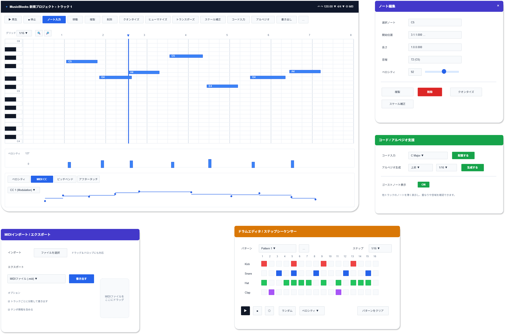

# 機能定義書:MIDI編集機能

[機能設計書概要へ](../Readme.md)

## 1. 機能概要

MIDI編集機能は、Musicflows上でメロディ、ベース、ドラムなどの演奏データを視覚的に入力・編集するための機能群である。

初心者が楽器を弾けなくても作曲できるように、音程と長さを視覚的に扱えるピアノロール、クリック操作によるノート入力、リズムを整えるクオンタイズを中心に提供する。

一般的なDAWのMIDI編集機能は多機能で複雑になりやすいため、Musicflowsでは「置く」「動かす」「伸ばす」「消す」「整える」「補助を使う」という基本操作を優先し、初心者でも破綻しにくい作曲体験を目指す。

- 実装機能
  - ピアノロール
  - ノート入力
  - ノート移動
  - ノート長変更
  - ノート削除
  - ノート複製
  - ベロシティ編集
  - クオンタイズ
  - ドラムエディタ
  - ステップシーケンサー

- 今後導入予定機能
  - ヒューマナイズ
  - ゴーストノート表示
  - トランスポーズ
  - MIDI CC編集
  - アフタータッチ編集
  - ピッチベンド編集

## 2.機能別目的一覧

| 機能名               | 説明                         | 目的                                                                     |
| :------------------- | :--------------------------- | :----------------------------------------------------------------------- |
| ピアノロール         | 音程と長さを視覚的に編集する | 楽器が弾けないユーザーでも、音の高さと長さを見ながら作曲できるようにする |
| ノート入力           | MIDIノートを配置する         | クリックやステップ操作でメロディや伴奏を作成できるようにする             |
| ノート移動           | 音程・位置を変更する         | 入力した音の高さやタイミングを後から調整できるようにする                 |
| ノート長変更         | 音の長さを変更する           | 伸ばす音、短く切る音などを調整し、フレーズを作りやすくする               |
| ノート削除           | 不要な音を消す               | 入力ミスや不要な音を取り除けるようにする                                 |
| ノート複製           | 音符をコピーする             | 同じリズムやフレーズを効率よく再利用できるようにする                     |
| ベロシティ編集       | 音の強さを調整する           | 強弱を付けて、機械的すぎない演奏にできるようにする                       |
| クオンタイズ         | タイミングを拍に揃える       | 入力位置のズレを補正し、整ったリズムにする                               |
| ドラムエディタ       | ドラム用のMIDI編集画面       | キック、スネア、ハイハットなどをリズムパターンとして編集しやすくする     |
| ステップシーケンサー | グリッドでパターンを作る     | 初心者がリズムや短いフレーズをマス目感覚で作れるようにする               |

## 3. 機能別利用シーン

| 機能名               | 利用シーン                                                 |
| :------------------- | :--------------------------------------------------------- |
| ピアノロール         | メロディやベースラインの音程と長さを細かく編集したいとき   |
| ノート入力           | 新しいメロディ、コード、ベース音を置きたいとき             |
| ノート移動           | 音程が合わない、タイミングがずれている音を直したいとき     |
| ノート長変更         | 音を伸ばしたり、短く切ったりしてフレーズ感を調整したいとき |
| ノート削除           | 不要な音や間違って入力した音を消したいとき                 |
| ノート複製           | 同じ音型やリズムを別の場所に繰り返したいとき               |
| ベロシティ編集       | 音の強弱を付けて、自然な演奏感を出したいとき               |
| クオンタイズ         | 入力タイミングを拍やグリッドに揃えたいとき                 |
| ドラムエディタ       | ドラムパターンを専用画面で作りたいとき                     |
| ステップシーケンサー | グリッド上で短いリズムやパターンを直感的に作りたいとき     |

## 4. 各機能画面イメージ

## 5. ルール・制約

| 機能名               | ルール・制約                                                                                             |
| :------------------- | :------------------------------------------------------------------------------------------------------- |
| ピアノロール         | 初心者向けに、初期状態では必要最小限の音域と小節範囲を表示する。拡大縮小やスクロールは段階的に提供する。 |
| ノート入力           | スナップON時はグリッド単位で配置する。スケール補助ON時はスケール内の音を優先して入力できるようにする。   |
| ノート移動           | 移動後の位置が範囲外にならないよう制御する。スナップON時はグリッドに吸着させる。                         |
| ノート長変更         | 極端に短すぎる長さや負の長さにはできないようにする。初期版では固定単位の長さ変更でもよい。               |
| ノート削除           | 削除後は再生データに即時反映する。Undoで戻せる設計が望ましい。                                           |
| ノート複製           | 複製先が既存ノートと重なる場合の扱いを定義する。初期版では同位置複製後に移動させる仕様でもよい。         |
| ベロシティ編集       | 初心者向けに、数値入力よりもバーやプリセットで調整できるようにする。                                     |
| クオンタイズ         | クオンタイズ単位はグリッド設定に連動させる。適用前後の差が大きい場合はUndo可能にする。                   |
| ドラムエディタ       | ドラムトラック専用として表示する。音程名ではなくKick、Snareなどの名称で表示する。                        |
| ステップシーケンサー | 1小節または数小節単位のグリッド入力を基本とする。複雑なタイミング編集はピアノロール側に任せる。          |
