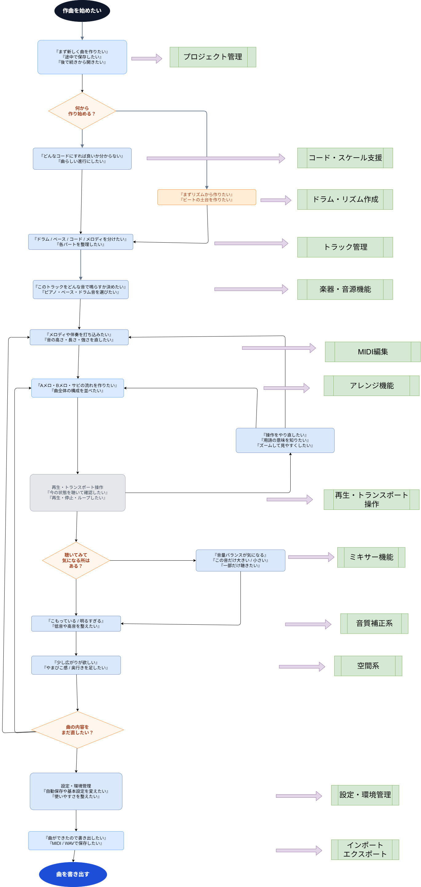

# 音楽作曲アプリ(Musicflows) 機能設計書（概要版）

## 1. 文書の目的

本書は、Musicflowsアプリで提供する主要機能を俯瞰して整理するための概要設計書である。  
詳細な画面仕様、API仕様、入力チェック仕様は別資料で管理する。

## 2. 想定利用者

### 2.1 主対象ユーザー

- DTM未経験者で、楽器も使ったことがないユーザー
- 音楽理論、楽器操作、DAW操作のすべてに不慣れ
- 「何を入力すれば曲らしくなるか」が分からない
- 多機能なDAWを見ると、どこから操作すればよいか分からなくなる

### 2.2 副対象ユーザー

- DTM未経験者だが、楽器経験はあるユーザー
- メロディやコードの感覚はあるが、DAWや打ち込み操作に不慣れ
- 音楽用語は一部理解できるが、ミキシング、音源設定、エフェクト設定は難しい

## 3. システムの目的

Musicflowsの目的は、初心者がブラウザ上で直感的に打ち込み作曲を行い、短い曲を完成させられる状態を作ることである。

本格DAWのように録音、外部プラグイン、高度なミックス、詳細なオーディオ編集をすべて提供するのではなく、初期段階では **作曲開始から保存・再生・編集・簡易調整・書き出しまでの基本フロー** に集中する。

| 課題                                   | 解決方法                                                                                             |
| :------------------------------------- | :--------------------------------------------------------------------------------------------------- |
| 機能が多くてどう使えばよいかわからない | 打ち込みの作曲に特化し、録音機能を排除することで機能自体をシンプル化させ、操作性を上げることができる |
| 音楽の専門用語が多い                   | 用語を補足しながら操作できるUIにすることで理解しながら作曲をすすめることができる                     |
| 設定が複雑                             | デフォルト設定、または設定しやすい画面UIを構築することにより音楽作成に集中できるようになる           |
| 作曲の始め方がわからない               | 作曲開始の導線があるためそれに従って作っていくことである程度の曲が作れる                             |
| 良し悪しがわからない                   | 破綻しにくい入力補助を用意することで初心者でも曲が作れるようになる                                   |

## 4. 機能マップ

### 4.1　実装機能

| 機能名                   | 役割                                                                                 | 個別機能定義書                                                   |
| :----------------------- | :----------------------------------------------------------------------------------- | :--------------------------------------------------------------- |
| プロジェクト管理         | 新規作成、保存、自動保存、プロジェクト設定など、楽曲データを管理する                 | [プロジェクト管理機能](./プロジェクト管理機能/Readme.md)         |
| アレンジ機能             | タイムライン、小節グリッド、クリップ配置、セクション管理など、曲全体の構成を管理する | [アレンジ機能](./アレンジ機能/Readme.md)                         |
| トラック管理             | ドラム、ベース、コード、メロディなど、音の種類ごとにトラックを管理する               | [トラック管理](./トラック管理/Readme.md)                         |
| 再生・トランスポート操作 | 再生、停止、先頭へ戻る、ループ再生、BPM変更、拍子変更などを行う                      | [再生・トランスポート操作](./再生・トランスポート操作/Readme.md) |
| MIDI編集                 | ピアノロール、ノート入力、ノート移動、長さ変更、ベロシティ編集などを行う             | [MIDI編集](./MIDI編集/Readme.md)                                 |
| 楽器・音源機能           | MIDIやパターンを実際の音として鳴らすための音源・プリセットを提供する                 | [楽器・音源機能](./楽器・音源機能/Readme.md)                     |
| 音質補正系               | EQ、フィルターなどで音の明るさ、こもり、低音・高音の整理を行う                       | [音質補正系](./音質補正系/Readme.md)                             |
| 空間系                   | リバーブ、ディレイ、コーラスなどで音の広がりや奥行きを調整する                       | [空間系](./空間系/Readme.md)                                     |
| ミキサー機能             | トラックごとの音量、パン、ミュート、ソロ、メーター表示を管理する                     | [ミキサー機能](./ミキサー機能/Readme.md)                         |
| コード・スケール支援     | コード入力、コード提案、スケール設定、スケール外ノート警告、自動伴奏などを提供する   | [コード・スケール支援](./コード・スケール支援/Readme.md)         |
| ドラム・リズム作成       | ステップシーケンサー、ドラムキット選択、ベロシティ編集、パターン保存などを提供する   | [ドラム・リズム作成](./ドラム・リズム作成/Readme.md)             |
| 表示・UI支援             | Undo/Redo、ドラッグ操作、ズーム、用語補足、ガイド表示などを提供する                  | 作成予定                                                         |
| インポート・エクスポート | 初期段階ではMIDI/WAV書き出しなど、完成データの出力を最小限提供する                   | 作成予定                                                         |
| 設定・環境管理           | 自動保存、テーマ、言語、基本オーディオ設定など、最低限の環境設定を管理する           | 作成予定                                                         |

### 4.2 実装予定機能：未定

初期MVPでは必須ではないが、基本作曲フローが成立した後に、制作体験を広げるために導入を検討する。

| 機能名               | 内容                                                                                   | 実装予定理由                                                                                              |
| :------------------- | :------------------------------------------------------------------------------------- | :-------------------------------------------------------------------------------------------------------- |
| エフェクト機能       | コンプレッサー、リミッター、ゲート、マキシマイザーなど                                 | 初期MVPでは本格ミックスより作曲を優先する。導入時は「音を整える」「音割れを防ぐ」などプリセット中心にする |
| 歪み・特殊効果       | ディストーション、オーバードライブ、ビットクラッシャー、ボコーダー、オートチューンなど | 作曲の基礎には必須ではないが、ジャンル別の表現拡張として有効                                              |
| オートメーション機能 | 音量、パン、エフェクト値、BPMなどを時間変化させる                                      | 表現力は高いが操作難易度が高いため、初期段階では優先度を下げる                                            |
| ループ・素材管理     | 素材ブラウザ、タグ検索、BPM同期、ドラッグ&ドロップ配置など                             | 初心者の作曲補助として有効だが、素材依存になりすぎないよう補助機能として扱う                              |
| 楽譜・スコア機能     | 五線譜表示、コード記号、MusicXML入出力、スコア印刷など                                 | 主対象ユーザーは楽譜を読めない可能性が高いため、初期段階では補助表示程度にする                            |
| 解析・メーター系     | BPM検出、キー検出、コード検出、スペクトラム表示、クリッピング検出など                  | 専門的な解析よりも「音が大きすぎる」「キーに合っていない」など初心者向け診断として導入する                |
| マスタリング機能     | マスターEQ、コンプレッサー、リミッター、ラウドネス測定など                             | 初心者には難易度が高いため、「かんたん仕上げ」や自動調整プリセットとして扱う                              |
| AI・自動生成系       | メロディ、コード進行、ドラム、ベース、伴奏などの自動生成・提案                         | 単なる自動生成ではなく、理由を説明しながら作曲を補助する機能として導入すると差別化できる                  |
| コラボレーション機能 | 共有リンク、コメント、共同編集、権限管理など                                           | 初期段階では一人で作曲を完了できることを優先し、作品共有やレビューから段階導入する                        |

### 4.3 実装採用外機能

初期方針では、初心者向け・ブラウザ上・打ち込み作曲特化のコンセプトから外れるため、採用しない。

| 機能名                   | 内容                                                                                   | 実装採用外理由                                                                                 |
| :----------------------- | :------------------------------------------------------------------------------------- | :--------------------------------------------------------------------------------------------- |
| 録音機能                 | マイク録音、MIDI録音、テイク管理、入力モニタリングなど                                 | 録音は設定や権限、音声入力、テイク管理などが複雑になり、打ち込み特化の初期コンセプトから外れる |
| オーディオ編集           | 波形表示、カット、トリミング、フェード、ノーマライズ、タイムストレッチ、ノイズ除去など | 本格DAW化しやすく、初心者が迷う要因になるため初期対象外とする                                  |
| ボーカル制作支援         | ボーカル録音、ピッチ補正、ハモリ生成、歌詞表示、歌詞同期など                           | 歌もの制作は有用だが、録音機能を排除する初期方針と衝突するため対象外とする                     |
| 外部機器・プラグイン連携 | MIDIキーボード、オーディオインターフェース、VST/AUプラグイン連携など                   | 高度な制作環境では重要だが、設定が複雑で初心者の負担が大きいため初期対象外とする               |

## 5. 機能関連図



## 6. 個別機能定義書への展開方針

各機能は以下のテンプレートで個別機能定義書へ展開する。

```markdown
# 機能定義書:〇〇機能

## 1. 機能概要

## 2. 機能別目的一覧

## 3. 機能別利用シーン

## 4. 各機能画面イメージ

## 5. ルール・制約
```

## 補足: 初期MVPの基本方針

Musicflowsの初期MVPでは、以下を重視する。

- 録音ではなく、打ち込み作曲に特化する
- 専門用語よりも、初心者に伝わる目的ベースの表現を優先する
- 高度な自由度よりも、破綻しにくい入力補助を優先する
- 既存DAWの全機能を再現せず、初心者が1曲を完成させる体験を優先する
- 画面上では「作る」「聴く」「直す」「保存する」の導線を明確にする
