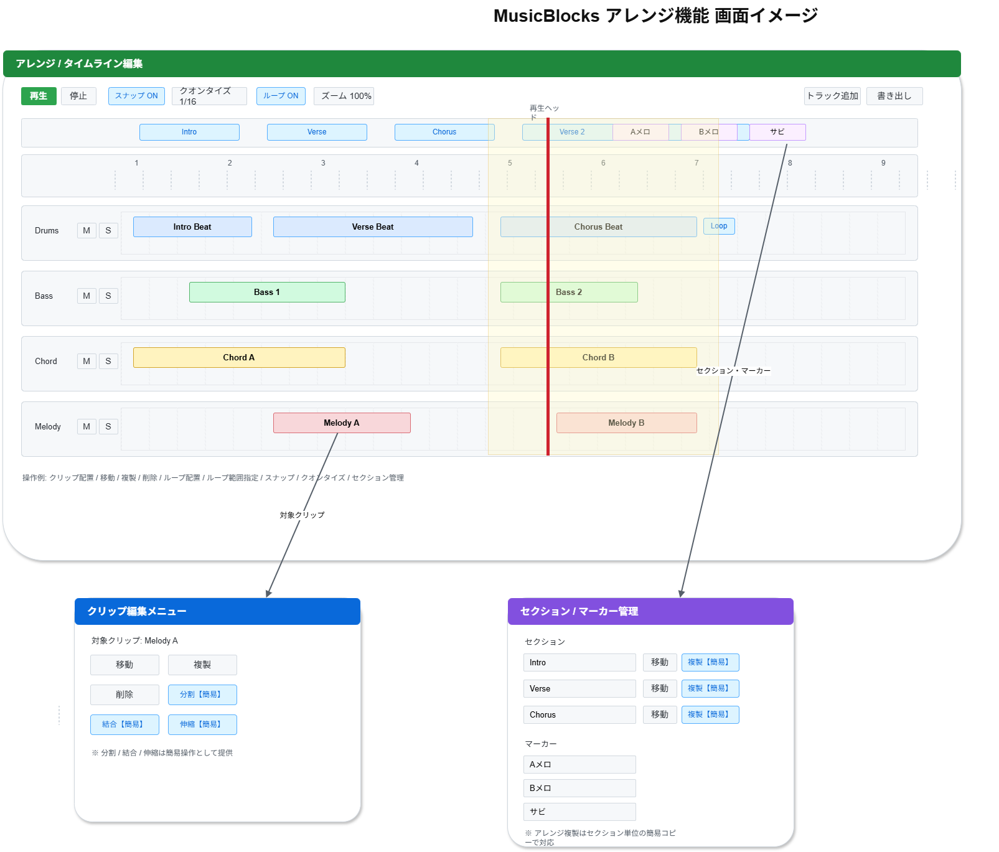

# 機能定義書:アレンジ機能

[機能設計書概要へ](../Readme.md)

## 1. 機能概要

アレンジ機能は、楽曲全体を時間軸上で管理し、各トラックに配置したクリップを組み合わせながら曲の構成を作るための機能である。  
Musicflows では、初心者でも曲全体の流れを視覚的に把握しやすいように、タイムライン・グリッド・セクション・マーカーを中心としたシンプルな構成で提供する。

本機能では、複雑なDAW操作をそのまま再現するのではなく、初心者が「並べる・動かす・繰り返す・区切る」といった基本操作で楽曲構成を組み立てられることを重視する。  
そのため、一部機能は **簡易的なUI / コンセプト化した形** で採用する。

- 実装機能
  - タイムライン表示
  - 小節・拍グリッド表示
  - トラック配置
  - クリップ配置
  - クリップ移動
  - クリップ複製
  - クリップ分割
  - クリップ結合
  - クリップ削除
  - クリップ伸縮
  - スナップ
  - クオンタイズ配置
  - マーカー
  - セクション管理
  - アレンジ複製
  - タイムライン拡大縮小
  - 再生ヘッド移動
  - ループ範囲指定

- 今後導入予定機能
  - なし

---

## 2.機能別目的一覧

| 機能名               | 説明                                                 | 目的                                                                       |
| :------------------- | :--------------------------------------------------- | :------------------------------------------------------------------------- |
| タイムライン表示     | 楽曲全体を時間軸上に表示する                         | 曲全体の構成や進行状況を視覚的に把握できるようにする                       |
| 小節・拍グリッド表示 | 小節、拍、16分音符などの単位で表示する               | 配置位置やリズムの基準を明確にし、初心者でも整った配置がしやすいようにする |
| トラック配置         | 複数トラックを縦方向に並べる                         | ドラム、ベース、コード、メロディなど役割ごとに整理して編集できるようにする |
| クリップ配置         | オーディオ / MIDI クリップをタイムライン上に配置する | 楽曲構成をブロック感覚で組み立てられるようにする                           |
| クリップ移動         | クリップをドラッグして移動する                       | 曲構成を試行錯誤しながら簡単に調整できるようにする                         |
| クリップ複製         | クリップをコピーして再利用する                       | 同じパターンを効率よく繰り返し利用できるようにする                         |
| クリップ分割         | 指定位置でクリップを切る                             | クリップの一部だけを編集・入れ替えしやすくする                             |
| クリップ結合         | 複数クリップをまとめる                               | 分割した構成を整理し、扱いやすくする                                       |
| クリップ削除         | 不要なクリップを消す                                 | 不要な音素材や構成要素を簡単に整理できるようにする                         |
| クリップ伸縮         | クリップの長さを変更する                             | 長さ調整やループ長の最適化を行いやすくする                                 |
| スナップ             | クリック単位に吸着して配置する                       | リズムがずれにくく、初心者でも正確に配置できるようにする                   |
| クオンタイズ配置     | タイミングを拍に揃える                               | 配置タイミングのズレを補正し、整った演奏データを作れるようにする           |
| マーカー             | Aメロ、サビなどの位置に印を付ける                    | 曲の区切りをわかりやすくし、構成把握や移動をしやすくする                   |
| セクション管理       | Intro / Verse / Chorus などを管理する                | 楽曲構成をまとまり単位で整理しやすくする                                   |
| アレンジ複製         | セクション単位でコピーする                           | 似た構成を効率よく増やし、楽曲全体を組み立てやすくする                     |
| タイムライン拡大縮小 | 横方向・縦方向のズームを行う                         | 全体確認と細かい編集を切り替えやすくする                                   |
| 再生ヘッド移動       | 現在の再生位置を移動する                             | 聴きたい箇所からすぐ再生・確認できるようにする                             |
| ループ範囲指定       | 指定範囲を繰り返し再生する                           | 一部の区間を集中的に確認・修正できるようにする                             |

---

## 3. 機能別利用シーン

| 機能名               | 利用シーン                                                            |
| :------------------- | :-------------------------------------------------------------------- |
| タイムライン表示     | 曲全体の流れを見ながら構成を考えたいとき                              |
| 小節・拍グリッド表示 | リズムを意識して、決まった拍位置に素材を置きたいとき                  |
| トラック配置         | ドラム、ベース、コード、メロディを分けて編集したいとき                |
| クリップ配置         | フレーズやループ素材を曲の中に置いて構成を作りたいとき                |
| クリップ移動         | サビを後ろにずらす、Aメロの開始位置を調整するなど構成を変更したいとき |
| クリップ複製         | 同じドラムパターンやコード進行を別の小節に再利用したいとき            |
| クリップ分割         | クリップの途中から展開を変えたいとき、前半と後半を別扱いしたいとき    |
| クリップ結合         | 細かく分けたクリップをひとまとまりとして扱いたいとき                  |
| クリップ削除         | 不要なフレーズや配置ミスを消したいとき                                |
| クリップ伸縮         | ループ長を調整したいとき、セクションの尺に合わせたいとき              |
| スナップ             | グリッドからずれないように素材を正確に置きたいとき                    |
| クオンタイズ配置     | 入力したタイミングのズレを整えたいとき                                |
| マーカー             | Aメロ、Bメロ、サビなどの位置をわかりやすく示したいとき                |
| セクション管理       | Intro、Verse、Chorusなどを区切って楽曲全体を整理したいとき            |
| アレンジ複製         | Verseを複製してVerse 2を作るなど、似た構成をすばやく追加したいとき    |
| タイムライン拡大縮小 | 全体を俯瞰したいとき、または細かい位置調整をしたいとき                |
| 再生ヘッド移動       | 特定の小節やサビ直前から再生したいとき                                |
| ループ範囲指定       | サビ部分だけを繰り返し聴いて調整したいとき                            |

---

## 4. 各機能画面イメージ

---

## 5. ルール・制約

| 機能名               | ルール・制約                                                                                                             |
| :------------------- | :----------------------------------------------------------------------------------------------------------------------- |
| タイムライン表示     | 初心者向けに、初期表示では全体構成を把握しやすい倍率を採用する。過度に複雑な表示情報は初期版では抑制する。               |
| 小節・拍グリッド表示 | グリッドは小節・拍・細分単位を切り替え可能とするが、初期版では 1/4、1/8、1/16 を中心にする。                             |
| トラック配置         | トラックは縦並び固定とし、初期版では自由な無制限追加ではなく、必要最小限の構成を基本とする。                             |
| クリップ配置         | クリップはタイムライン上の有効範囲にのみ配置できる。トラック種別に合わない素材は配置不可としてもよい。                   |
| クリップ移動         | スナップON時はグリッドに吸着する。重なりルールは初期版で明確化し、同一トラック上では不正な重複を制限してもよい。         |
| クリップ複製         | 複製後のクリップは元クリップとは別インスタンスとして扱う。複製先が配置不可領域の場合はエラーまたはキャンセルとする。     |
| クリップ分割         | 初期版では再生ヘッド位置または指定グリッド位置での簡易分割とする。任意の複数点分割は対象外でもよい。                     |
| クリップ結合         | 結合対象は同一トラック上で隣接または連続したクリップに限定する。異種クリップの結合は対象外でもよい。                     |
| クリップ削除         | 削除前確認は任意とし、Undoで戻せる設計が望ましい。削除後は再生結果にも即時反映する。                                     |
| クリップ伸縮         | 初期版では端をドラッグする簡易操作とする。極端に短い長さや不正な長さにはできないよう制御する。                           |
| スナップ             | ON/OFF切替可能とする。初期状態はONを推奨し、初心者の配置ミスを減らす。                                                   |
| クオンタイズ配置     | クオンタイズ単位はグリッド設定に連動させてもよい。原音情報を完全破壊しない簡易補正方針が望ましい。                       |
| マーカー             | マーカー名はユーザーが識別しやすい名称に限定する。数が増えすぎると視認性が落ちるため表示件数に配慮する。                 |
| セクション管理       | セクションは曲構成単位として扱い、名称は Intro / Verse / Chorus などから選択可能にする。初期版では階層構造は持たせない。 |
| アレンジ複製         | 初期版ではセクション単位の簡易コピーとして実装する。複製時に関連クリップをまとめて複製する。                             |
| タイムライン拡大縮小 | 初期版ではズーム段階を離散的にしてもよい。過度な自由ズームよりも、全体表示と詳細表示の切り替えを重視する。               |
| 再生ヘッド移動       | クリックまたはドラッグで移動可能とする。移動後は再生開始位置として扱えるようにする。                                     |
| ループ範囲指定       | 開始位置と終了位置はグリッド基準で指定できるようにする。範囲未設定時は通常再生とする。                                   |
