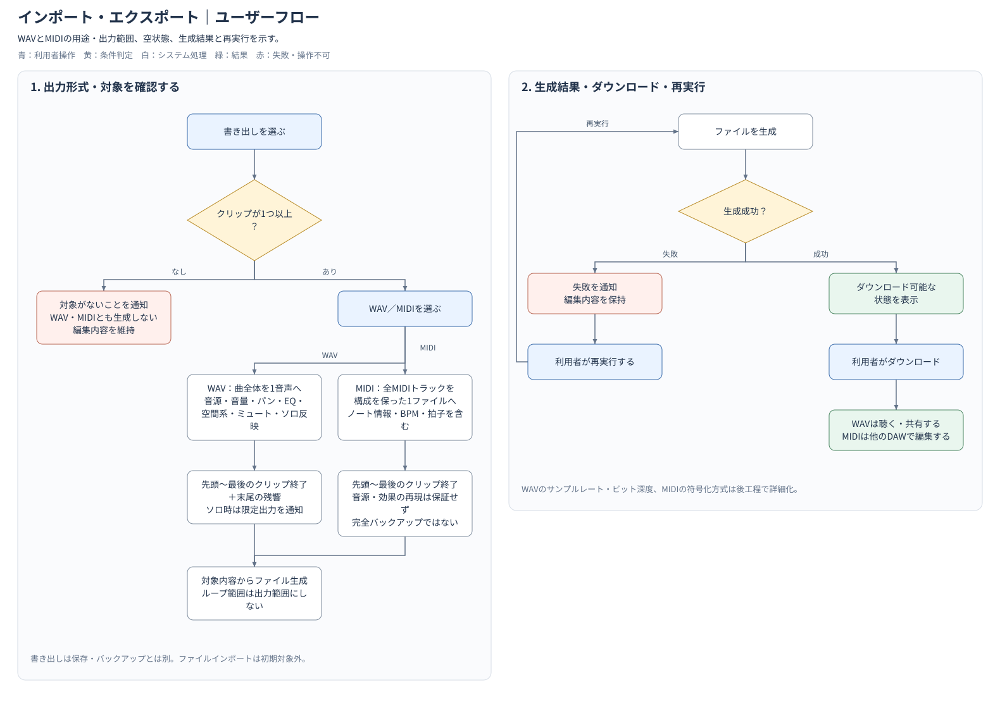

# 機能定義書:インポート・エクスポート機能

[機能設計書概要へ](../Readme.md)

## 1. 機能概要

インポート・エクスポート機能は、Musicflowsで作成した曲をファイルとして持ち出すための機能である。アプリにログインし、自身が作成したプロジェクトを扱う利用者を対象とする。

初期版はWAV・MIDIの書き出しを提供する。WAVは完成した曲を聴く・共有するための音声、MIDIは他のDAWで編集するための演奏データとして扱う。ファイルのインポートは初期対象外とする。

- 実装機能
  - WAV書き出し
  - MIDI書き出し

- 今後導入予定機能
  - 未定（ファイルインポートは初期対象外。導入する場合は対応形式・範囲を別途決定する）

## 2.機能別目的一覧

| 機能名 | 説明 | 目的 |
| :--- | :--- | :--- |
| WAV書き出し | 曲全体を1つの音声ファイルとして出力する | 完成した曲をMusicflows以外の環境で聴く・共有できるようにする |
| MIDI書き出し | 全MIDIトラックを1つのMIDIファイルとして出力する | 他のDAWで曲全体の編集を続けられるようにする |

## 3. 機能別利用シーン

| 機能名 | 利用シーン |
| :--- | :--- |
| WAV書き出し | 完成した曲を音声ファイルとして聴きたい、他者へ渡したいとき |
| MIDI書き出し | 入力した演奏データを他のDAWへ持ち出して編集したいとき |

利用者が形式を選択すると、システムがファイルを生成する。生成成功後はダウンロード可能な状態を表示し、利用者がダウンロードする。生成に失敗した場合は編集内容を保持して失敗を通知し、利用者が再実行できるようにする。

**ユーザーフロー図**

## 4. 各機能画面イメージ

画面イメージは未作成とする。作成する場合は参考図として扱い、画面の構成や表示項目が本文と異なる場合は、機能設計書本文を正とする。

## 5. ルール・制約

**初期版の書き出しルール**

初期版はファイルのインポートを対象外とし、WAV・MIDIの書き出しを提供する。WAVは「完成した曲」、MIDIは「他のDAWで編集するための演奏データ」と説明する。書き出しはプロジェクト保存とは別の機能とする。

| 項目 | ルール |
| :--- | :--- |
| WAVの出力対象 | 曲全体を1つの音声ファイルに出力する。トラック別出力・選択範囲出力は初期対象外とする。 |
| WAVに反映する内容 | 音源・音量・パン・EQ・空間系効果を反映する。ミュート・ソロはミキサー機能で定めた再生ルールと同じ扱いとする。 |
| WAV出力時のソロ | ソロ指定が残っている場合、その状態で再生対象になるトラックだけが出力されることを利用者に示す。 |
| 出力範囲 | プロジェクト先頭から最後のクリップの終了位置までとする。WAVは末尾の残響も含める。ループ再生の指定範囲とは分ける。 |
| クリップがない場合 | プロジェクトにクリップが1つもない場合はWAV・MIDIとも書き出さず、書き出し対象がないことを通知する。ファイルは生成せず、編集内容を維持する。 |
| MIDIの出力対象 | 曲全体の全MIDIトラックを、トラック構成を保った1つのMIDIファイルとして出力する。 |
| MIDIに含める情報 | ノートの音程・位置・長さ・ベロシティ、BPM、拍子を含める。 |
| MIDIの位置付け | Musicflowsの音源プリセットやエフェクトによる音の再現は保証しない。完全なプロジェクトバックアップとしては扱わない。 |
| 正常時の流れ | 利用者が形式を選択し、システムがファイルを生成する。生成成功後はダウンロード可能な状態を表示し、利用者がダウンロードする。 |
| 失敗時の流れ | 編集内容を保持して失敗を通知する。利用者が書き出しを再実行できるようにする。 |

WAVのサンプルレート・ビット深度、MIDIの具体的な符号化方式、ファイル生成処理の内部構造は後工程で詳細化する。

ミュート・ソロの優先関係は[ミキサー機能](../ミキサー機能/Readme.md)に従う。書き出し操作は[表示・UI支援機能](../表示・UI支援/Readme.md)のUndo/Redo対象外とする。
