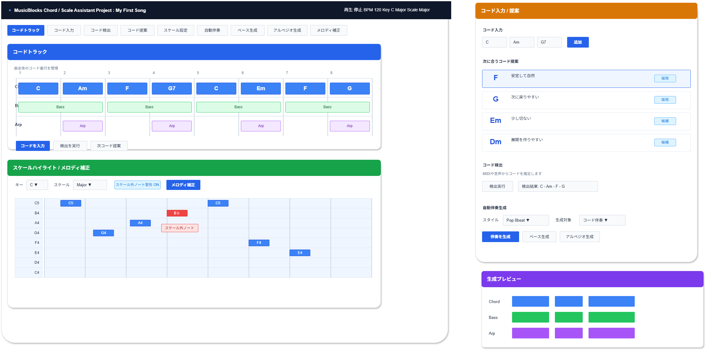
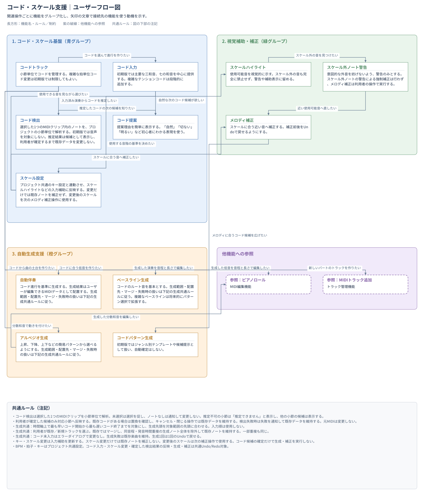

# 機能定義書:コード・スケール支援機能

[機能設計書概要へ](../Readme.md)

## 1. 機能概要

コード・スケール支援機能は、Musicflowsで初心者が音楽理論を深く理解していなくても、コード進行、スケール、伴奏、ベースライン、アルペジオ、メロディを作りやすくするための作曲補助機能群である。

本機能では、曲全体のコード進行を管理するコードトラックを中心に、コード入力、コード検出、コード提案、スケール設定、スケールハイライト、スケール外ノート警告を提供する。さらに、入力したコード進行をもとに、自動伴奏、ベースライン生成、アルペジオ生成、メロディ補正を行い、初心者でも破綻しにくい作曲体験を実現する。

コードパターン生成は有用だが、テンプレート設計やジャンル管理が必要になるため、初期版ではコンセプト化して採用し、段階的に具体化する。

- 実装機能
  - コードトラック
  - コード入力
  - コード検出
  - コード提案
  - スケール設定
  - スケールハイライト
  - スケール外ノート警告
  - 自動伴奏
  - ベースライン生成
  - アルペジオ生成
  - メロディ補正

- 今後導入予定機能
  - なし  
    ※今回の対象一覧では「将来候補」に該当する機能なし

## 2.機能別目的一覧

| 機能名               | 説明                             | 目的                                                                           |
| :------------------- | :------------------------------- | :----------------------------------------------------------------------------- |
| コードトラック       | 曲全体のコード進行を管理する     | 楽曲全体の和声構造を視覚的に整理し、伴奏やメロディ生成の基準にする             |
| コード入力           | C、Am、G7などを入力する          | 初心者でもコード名を選択して、簡単にコード進行を作れるようにする               |
| コード検出           | 選択した1つのMIDIクリップ内のノートから小節ごとのコード候補を推定する | 入力済みの演奏データからコードを推定し、編集や補助機能に利用できるようにする   |
| コード提案           | 次に合うコードを提案する         | コード進行に迷ったとき、自然な次のコード候補を提示して作曲を進めやすくする     |
| スケール設定         | メジャー、マイナーなどを設定する | 曲で使用する音階の基準を決め、入力補助や補正に利用する                         |
| スケールハイライト   | ピアノロールで使用可能音を表示   | 使ってよい音を視覚的に示し、初心者が音を選びやすくする                         |
| スケール外ノート警告 | 不協和な音を見つける             | スケール外の音を警告し、意図しない不自然な音を減らす                           |
| 自動伴奏             | コードに合わせて伴奏を生成       | コード進行から伴奏パターンを作り、曲の土台をすばやく作れるようにする           |
| ベースライン生成     | コードに合わせてベース生成       | コード進行に合う低音パートを自動生成し、曲の安定感を作る                       |
| アルペジオ生成       | コードからアルペジオ生成         | コードを分散和音に変換し、動きのある伴奏を作れるようにする                     |
| コードパターン生成   | メロディにハモリを付ける         | メロディやジャンルに合うコードパターンを提案し、作曲の幅を広げる               |
| メロディ補正         | スケールに合わせて補正する       | スケール外の音を近い使用可能音へ補正し、破綻しにくいメロディを作れるようにする |

## 3. 機能別利用シーン

| 機能名               | 利用シーン                                                                   |
| :------------------- | :--------------------------------------------------------------------------- |
| コードトラック       | 曲全体のコード進行を小節単位で管理したいとき                                 |
| コード入力           | C、Am、G7などのコードを直接入力して進行を作りたいとき                        |
| コード検出           | 入力済みのMIDIクリップを選び、コード候補を確認してコードトラックへ反映したいとき |
| コード提案           | 次にどのコードを置けば自然かわからないとき                                   |
| スケール設定         | 曲のキーやスケールを決め、作曲補助の基準にしたいとき                         |
| スケールハイライト   | ピアノロール上で使える音を見ながらメロディを作りたいとき                     |
| スケール外ノート警告 | 不自然に聞こえる可能性がある音を見つけたいとき                               |
| 自動伴奏             | コード進行だけ決めて、伴奏パターンを自動で作りたいとき                       |
| ベースライン生成     | コードに合うベースラインを自分で考えるのが難しいとき                         |
| アルペジオ生成       | コードをそのまま鳴らすのではなく、動きのある分散和音にしたいとき             |
| コードパターン生成   | メロディに合うコード進行やハモリを提案してほしいとき                         |
| メロディ補正         | 作ったメロディがスケールから外れていないか確認し、必要に応じて補正したいとき |

## 4. 各機能画面イメージ

画面イメージは参考図とする。画面の構成や表示項目が本文と異なる場合は、機能設計書本文を正とする。

## 5. ルール・制約

| 機能名               | ルール・制約                                                                                 |
| :------------------- | :------------------------------------------------------------------------------------------- |
| コードトラック       | 小節単位でコードを管理する。複雑な拍単位コード変更は初期版では制限してもよい。               |
| コード入力           | 初期版では主要な三和音、七の和音を中心に提供する。複雑なテンションコードは段階的に追加する。 |
| コード検出           | 選択した1つのMIDIクリップ内のノートを、プロジェクトの小節単位で解析する。初期版では音声を対象にしない。推定結果は候補として表示し、利用者が確定するまで既存データを変更しない。 |
| コード提案           | 提案理由を簡単に表示する。「自然」「切ない」「明るい」など初心者にわかる表現を使う。         |
| スケール設定         | プロジェクト共通のキー設定と連動させ、スケールハイライトなどの入力補助に反映する。変更だけでは既存ノートを補正せず、変更後のスケールを次のメロディ補正操作に使用する。 |
| スケールハイライト   | 使用可能音を視覚的に示す。スケール外の音も完全に禁止せず、警告や補助表示に留める。           |
| スケール外ノート警告 | 意図的な外音を妨げないよう、警告のみとする。スケール外ノートの警告による強制補正は行わず、メロディ補正は利用者の操作で実行する。 |
| 自動伴奏             | コード進行を基準に生成する。生成結果はユーザーが編集できるMIDIデータとして配置する。生成範囲・配置先・マージ・失敗時の扱いは下記の生成共通ルールに従う。 |
| ベースライン生成     | コードのルート音を基本とする。生成範囲・配置先・マージ・失敗時の扱いは下記の生成共通ルールに従う。複雑なベースラインは将来的にパターン選択で拡張する。 |
| アルペジオ生成       | 上昇、下降、上下などの簡易パターンから選べるようにする。生成範囲・配置先・マージ・失敗時の扱いは下記の生成共通ルールに従う。 |
| コードパターン生成   | 初期版ではジャンル別テンプレートや候補提示として扱い、自動確定はしない。                     |
| メロディ補正         | スケールに合う近い音へ補正する。補正前後をUndoで戻せるようにする。                           |

**コード検出結果の反映・例外時のルール**

| 状況・操作 | 結果 |
| :--- | :--- |
| 検出から確定まで | MIDIクリップを選択して検出し、小節ごとの候補を確認する。利用者が確定した候補だけを、元のクリップと対応する小節のコードトラックへ反映する。 |
| 対象クリップが未選択 | 対象の選択を促す。 |
| 対象クリップにノートがない | 対象データがないことを通知し、変更しない。 |
| 一部の小節で推定できない | その小節は「推定できません」と表示し、推定できた小節の候補は表示する。 |
| 検出処理が失敗 | 失敗を通知し、既存データを維持する。 |
| 確定する小節に既存コードがある | 置換するか利用者へ確認する。キャンセル時は既存コードを維持する。 |
| 候補画面を閉じる・キャンセルする | コードトラックと元のMIDIノートを変更しない。 |

コード候補の確定だけでは、伴奏生成や既存ノートの補正を実行しない。元のMIDIノートは変更しない。確定したコード検出結果の反映はUndoで戻せるようにする。

**自動伴奏・ベースライン生成・アルペジオ生成の共通ルール**

- 生成範囲は、コードトラックの時間軸上で最も早いコードの開始位置から、最も遅いコードの終了位置までとする。コードを入力した順番は使用しない。
- 生成結果の先頭は、対象コード範囲の先頭に合わせる。
- 利用者が、既存トラックへの生成か新規トラックへの生成かを選ぶ。既存トラックへ生成する場合は対象トラックを選ぶ。
- 既存トラックでは生成ノートをマージする。同じ音程で発音時間が重なる生成ノートは追加せず、既存ノートを維持する。時間の一部だけが重なる場合も、その生成ノート全体を追加対象から除外する。
- コード未入力時はエラーダイアログを表示し、楽曲を変更しない。
- 生成失敗時は既存楽曲を維持する。生成1回の結果は1回のUndoで戻せるようにする。

BPM・拍子・キーはプロジェクト共通設定とする。キー変更は入力補助に反映し、既存ノートの音程を自動変換しない。コード入力・スケール変更・生成・補正は、[表示・UI支援機能](../表示・UI支援/Readme.md)のUndo/Redo共通ルールに従う。

## ユーザーフロー図

