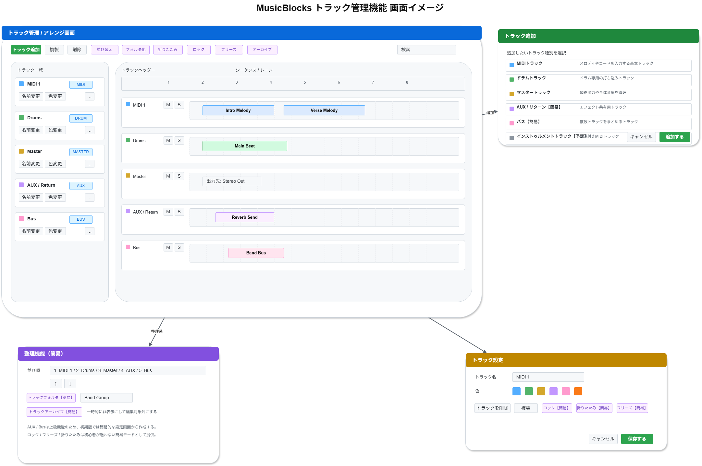

# 機能定義書:トラック管理機能

[機能設計書概要へ](../Readme.md)

## 1. 機能概要

トラック管理機能は、MusicBlocks 上で作曲に使用する各トラックを追加・整理・編集するための機能である。  
初心者向けのアプリであることを前提に、一般的なDAWの高機能なトラック管理をそのまま再現するのではなく、**作曲に必要な基本トラックをわかりやすく扱えること** を重視する。

本機能では、メロディやコード入力に利用するMIDIトラック、リズム入力に利用するドラムトラック、全体出力を管理するマスタートラックを中心に構成する。加えて、AUX / リターントラックやバストラック、ロック、フリーズ、アーカイブなどの一部機能は、初心者が迷いにくいよう **簡易的なUI・コンセプト化した形** で提供する。

- 実装機能
  - MIDIトラック追加
  - ドラムトラック追加
  - AUX / リターントラック
  - バストラック
  - マスタートラック
  - トラック名変更
  - トラック色変更
  - トラックの並び替え
  - トラック削除
  - トラック複製
  - トラックフォルダ
  - トラック折りたたみ
  - トラックロック
  - トラックフリーズ
  - トラックアーカイブ

- 今後導入予定機能
  - インストゥルメントトラック追加【予定】

## 2.機能別目的一覧

| 機能名                                 | 説明                             | 目的                                                                                 |
| :------------------------------------- | :------------------------------- | :----------------------------------------------------------------------------------- |
| MIDIトラック追加                       | MIDIデータ用のトラックを追加する | メロディやコードなど、作曲の中心となる打ち込みトラックを作成できるようにする         |
| ドラムトラック追加                     | ドラム入力専用トラックを追加する | リズムパターンを初心者でもわかりやすく作成できるようにする                           |
| AUX / リターントラック                 | エフェクト共有用トラック         | 複数トラックで共通のエフェクトを扱えるようにし、ミックスの基本概念を簡易的に提供する |
| バストラック                           | 複数トラックをまとめる           | 関連するトラック群をひとまとめに扱い、音量や処理を整理しやすくする                   |
| マスタートラック                       | 最終出力を管理する               | 曲全体の最終的な音量・出力を確認できるようにする                                     |
| トラック名変更                         | トラックに名前を付ける           | どのトラックが何の役割かをわかりやすく管理できるようにする                           |
| トラック色変更                         | 視認性のため色分けする           | トラックを視覚的に区別し、編集対象を見つけやすくする                                 |
| トラックの並び替え                     | トラックの順番を変更する         | 作業しやすい順にトラックを整理できるようにする                                       |
| トラック削除                           | 不要なトラックを削除する         | 作業途中で不要になったトラックを整理できるようにする                                 |
| トラック複製                           | 設定込みでトラックをコピーする   | 似た構成のトラックを効率よく増やせるようにする                                       |
| トラックフォルダ                       | 複数トラックをグループ化する     | トラック数が増えても整理しやすくする                                                 |
| トラック折りたたみ                     | 表示を省略する                   | 編集対象でないトラックを簡潔にし、画面を見やすくする                                 |
| トラックロック                         | 誤編集を防止する                 | 完成したトラックを誤って変更しないようにする                                         |
| トラックフリーズ                       | CPU負荷軽減のため音声化する      | 重いトラックの再生負荷を下げ、動作を安定させる考え方を簡易的に提供する               |
| トラックアーカイブ                     | 一時的に無効化・非表示にする     | 現在使っていないトラックを退避し、画面や作業対象を整理する                           |
| インストゥルメントトラック追加【予定】 | 音源付きMIDIトラックを追加する   | 初心者が音源設定を意識せずに演奏トラックを使えるようにする                           |

## 3. 機能別利用シーン

| 機能名                                 | 利用シーン                                                                     |
| :------------------------------------- | :----------------------------------------------------------------------------- |
| MIDIトラック追加                       | メロディやコード進行を新しく打ち込みたいとき                                   |
| ドラムトラック追加                     | ドラムパターンやリズムを入力したいとき                                         |
| AUX / リターントラック                 | リバーブなどの共通エフェクトを複数トラックで共有したいとき                     |
| バストラック                           | 複数トラックをまとめて音量調整や管理をしたいとき                               |
| マスタートラック                       | 曲全体の最終出力や全体音量を確認したいとき                                     |
| トラック名変更                         | 「MIDI 1」ではわかりづらいため、「サビメロ」など役割に応じて名前を付けたいとき |
| トラック色変更                         | トラックが増えたときに、色で種類や役割を見分けたいとき                         |
| トラックの並び替え                     | ドラム、ベース、コード、メロディなど、見やすい順に並べ替えたいとき             |
| トラック削除                           | 不要なテスト用トラックや使わなくなったトラックを消したいとき                   |
| トラック複製                           | 既存トラックをベースに似たフレーズや別パートをすぐ作りたいとき                 |
| トラックフォルダ                       | 複数の関連トラックをひとまとめに管理したいとき                                 |
| トラック折りたたみ                     | 編集しないトラックを一時的に小さく表示して画面を広く使いたいとき               |
| トラックロック                         | 完成したトラックを誤って編集したくないとき                                     |
| トラックフリーズ                       | 重くなったトラックを軽量化して安定して再生したいとき                           |
| トラックアーカイブ                     | 一時的に使わないトラックを残したまま非表示・無効化したいとき                   |
| インストゥルメントトラック追加【予定】 | 音源込みのトラックをワンアクションで追加してすぐ演奏入力したいとき             |

## 4. 各機能画面イメージ

## 5. ルール・制約

| 機能名                                 | ルール・制約                                                                                                               |
| :------------------------------------- | :------------------------------------------------------------------------------------------------------------------------- |
| MIDIトラック追加                       | 初期版では基本トラックとして優先表示する。デフォルト音源またはデフォルト設定を持たせ、追加後すぐ入力可能にする。           |
| ドラムトラック追加                     | ドラム専用の入力UIや音色セットを前提とする。初心者が迷わないよう、一般MIDIトラックより用途を明確にする。                   |
| AUX / リターントラック                 | 初期版では詳細ルーティングを省略し、共有エフェクト用の簡易トラックとして扱う。上級設定は隠す。                             |
| バストラック                           | 初期版ではグループ単位の簡易まとめ役として扱う。複雑な信号ルーティングは対象外とする。                                     |
| マスタートラック                       | 常に1つ存在する前提としてもよい。削除不可とし、最終出力管理用に固定表示する。                                              |
| トラック名変更                         | 空欄や重複名称を完全禁止する必要はないが、ユーザーが識別しやすいよう初期名は自動採番する。                                 |
| トラック色変更                         | 色の候補は限定し、視認性の高い色から選べるようにする。文字が見えにくくなる配色は避ける。                                   |
| トラックの並び替え                     | 初期版ではドラッグまたは上下ボタンによる簡易並び替えでもよい。マスタートラックなど固定位置のものは移動制限を設けてもよい。 |
| トラック削除                           | 削除前に確認ダイアログを出す、またはUndoで戻せるようにする。マスタートラックなど削除不可トラックを定義してよい。           |
| トラック複製                           | 複製時は名称に連番や「コピー」を付与する。複製元の設定を引き継ぐが、内部IDは別管理とする。                                 |
| トラックフォルダ                       | 初期版では表示上のグループ化を中心とし、複雑な階層ネストは扱わなくてもよい。                                               |
| トラック折りたたみ                     | 折りたたみ時も最低限、名前と状態は判別できるようにする。完全非表示にはしない。                                             |
| トラックロック                         | ロックされたトラックは編集操作を受け付けない。視覚的にロック状態がわかる表示を行う。                                       |
| トラックフリーズ                       | 初期版では本格的な音声レンダリングではなく、概念上の簡易機能として扱ってもよい。再編集の流れを明確にする。                 |
| トラックアーカイブ                     | アーカイブしたトラックは非表示または編集対象外にするが、完全削除はしない。復元手段を用意する。                             |
| インストゥルメントトラック追加【予定】 | 将来実装時には、音源設定の簡略化を重視し、初心者が「音が鳴らない」状態にならない設計を行う。                               |
