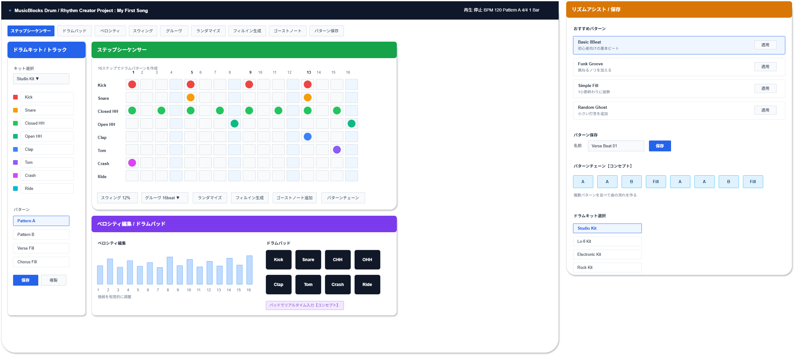

# 機能定義書:ドラム・リズム作成機能

[機能設計書概要へ](../Readme.md)

## 1. 機能概要

ドラム・リズム作成機能は、MusicBlocks上で初心者が直感的にビートやリズムパターンを作成できるようにするための機能群である。  
特に打ち込み作曲におけるリズム作成の入口として、グリッド中心の視覚的な入力方法を主軸にし、複雑な音楽理論や高度な編集知識がなくてもリズムを組み立てられることを目的とする。

MVPでは、**ステップシーケンサー**、**ベロシティ編集**、**ドラムキット選択**、**パターン保存**を中心に実装する。  
一方で、**ドラムパッド**、**スウィング**、**グルーヴ適用**、**ランダマイズ**、**フィルイン生成**、**ゴーストノート**、**パターンチェーン**は、制作体験を広げるうえで有効なため、コンセプト化して採用する。

- 実装機能
  - ステップシーケンサー
  - ベロシティ編集
  - ドラムキット選択
  - パターン保存
  - ドラムパッド
  - スウィング
  - グルーヴ適用
  - ランダマイズ
  - フィルイン生成
  - ゴーストノート
  - パターンチェーン

- 今後導入予定機能
  - なし

## 2.機能別目的一覧

| 機能名               | 説明                         | 目的                                                        |
| :------------------- | :--------------------------- | :---------------------------------------------------------- |
| ステップシーケンサー | グリッドでドラムパターン作成 | 初心者でも視覚的にビートを入力しやすくする                  |
| ドラムパッド         | パッドUIでドラム演奏         | リアルタイム入力や直感的な打ち込みを可能にする              |
| ベロシティ編集       | 打ち込みの強弱調整           | 機械的なリズムを避け、抑揚のある演奏感を作れるようにする    |
| スウィング           | リズムに跳ね感を加える       | ビートにノリやグルーヴ感を出せるようにする                  |
| グルーヴ適用         | 人間らしいノリを加える       | 打ち込み感を減らし、自然なタイミング変化を作れるようにする  |
| ランダマイズ         | ランダムにリズム生成         | 発想の補助や新しいビートのきっかけを作れるようにする        |
| フィルイン生成       | 展開前のドラム装飾を作る     | セクション切り替え時のつなぎを作りやすくする                |
| ゴーストノート       | 小さい打音を追加する         | リズムに細かなニュアンスを与え、単調さを減らす              |
| ドラムキット選択     | 音色セットを切り替える       | ジャンルや雰囲気に合わせてドラム音色を選べるようにする      |
| パターン保存         | 作成したリズムを保存する     | 作ったビートを再利用・整理できるようにする                  |
| パターンチェーン     | 複数パターンを並べる         | A/Bパターンやフィルを組み合わせ、曲の流れを作れるようにする |

## 3. 機能別利用シーン

| 機能名               | 利用シーン                                                                   |
| :------------------- | :--------------------------------------------------------------------------- |
| ステップシーケンサー | 16ステップのグリッド上でキックやスネアを配置し、基本ビートを作りたいとき     |
| ドラムパッド         | マウスやタップ操作で直感的にドラムを鳴らして入力したいとき                   |
| ベロシティ編集       | 同じリズムでも強弱を付けて、より自然なドラム感を出したいとき                 |
| スウィング           | 8ビートや16ビートに少し跳ねたノリを加えたいとき                              |
| グルーヴ適用         | 完全に均一な打ち込みではなく、人間らしいタイミングに寄せたいとき             |
| ランダマイズ         | 自分では思いつかないリズムのきっかけを得たいとき                             |
| フィルイン生成       | Aメロからサビに入る前など、区切りに短い装飾フレーズを入れたいとき            |
| ゴーストノート       | スネアやハイハットに小さい打音を加え、細かなノリを出したいとき               |
| ドラムキット選択     | ポップ、ロック、Lo-fi、エレクトロなど曲調に合わせて音色を変えたいとき        |
| パターン保存         | 気に入ったビートを保存して、別のプロジェクトや別セクションで再利用したいとき |
| パターンチェーン     | Pattern A、Pattern B、Fill を順番に並べて曲の流れを作りたいとき              |

## 4. 各機能画面イメージ

## 5. ルール・制約

| 機能名               | ルール・制約                                                                             |
| :------------------- | :--------------------------------------------------------------------------------------- |
| ステップシーケンサー | 初期版では 1小節 16ステップを基本とし、初心者が迷わない構成を優先する。                  |
| ドラムパッド         | 直感性を優先するが、初期版ではリアルタイム録音よりも簡易入力補助として扱ってもよい。     |
| ベロシティ編集       | 強弱は数値だけでなく棒グラフなど視覚的に調整できるようにする。                           |
| スウィング           | 専門用語だけでなく「少し跳ねる」など意味が伝わる補助説明を付ける。                       |
| グルーヴ適用         | 適用しすぎるとリズムが崩れるため、プリセット化や適用量の制限を設ける。                   |
| ランダマイズ         | 完全ランダムではなく、ある程度音楽的に成立する範囲で生成する。                           |
| フィルイン生成       | 小節終端など限定された位置に適用し、初心者が使いどころを理解しやすくする。               |
| ゴーストノート       | 主音より小さいベロシティで入れることを前提とし、入れすぎを防ぐ調整幅を設ける。           |
| ドラムキット選択     | 初期版ではキット数を絞り、音色の違いがわかりやすいセットを優先する。                     |
| パターン保存         | プロジェクト内保存を基本とし、将来的にテンプレート・ライブラリ化しやすい構造にする。     |
| パターンチェーン     | 初期版では簡易的に A / B / Fill を並べる構成から始め、複雑なソングモードは段階導入する。 |
