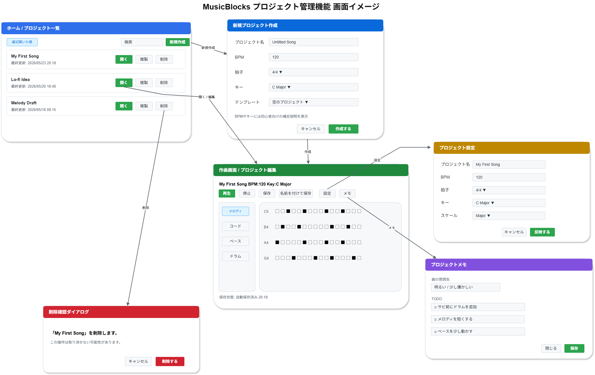
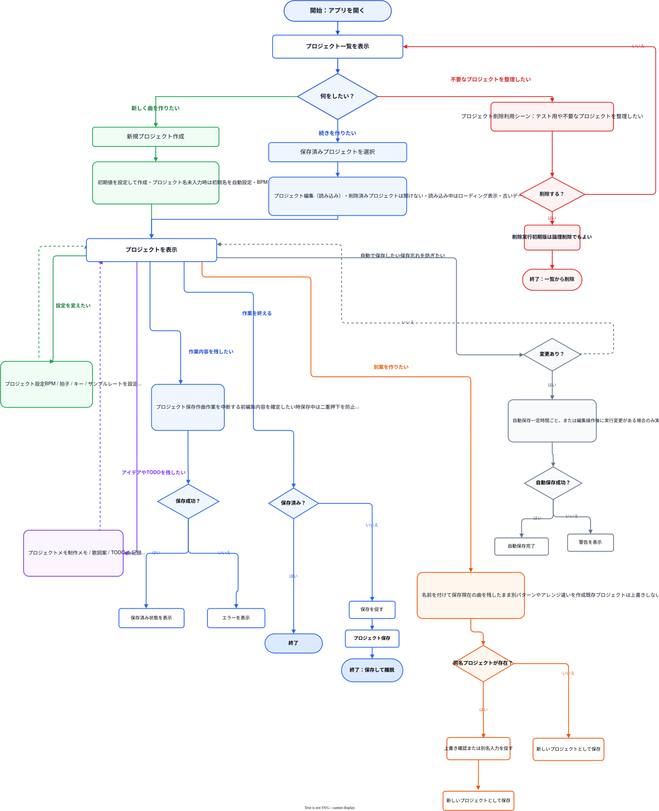

# 機能定義書:プロジェクト管理機能

[機能設計書概要へ](../Readme.md)

## 1. 機能概要

プロジェクト管理機能は、Musicflowsにおける楽曲制作単位である「プロジェクト」を作成、保存、再編集、削除するための機能群である。  
プロジェクトには、曲名、BPM、拍子、キー、トラック構成、ノート情報、制作メモなど、作曲作業を再開するために必要な情報を保持する。

本機能では、初心者が迷わず作曲を開始・中断・再開できることを重視する。

- 実装機能
  - プロジェクト一覧表示
  - プロジェクト表示
  - 新規プロジェクト作成
  - プロジェクト保存
  - 名前を付けて保存
  - 自動保存
  - プロジェクト設定
  - プロジェクトメモ
  - プロジェクト編集
  - プロジェクト削除

- 今後導入予定機能
  - プロジェクト複製
  - プロジェクトテンプレート
  - 最近使ったプロジェクト
  - バージョン管理

## 2.機能別目的一覧

| No  | 機能名               | 説明                                                     | 目的                                                                                                 |
| :-- | :------------------- | :------------------------------------------------------- | :--------------------------------------------------------------------------------------------------- |
| 001 | プロジェクト一覧表示 | 保存済みプロジェクトを一覧で表示する                     | 作成済みの楽曲プロジェクトを確認し、編集・削除・再開する対象を選びやすくする                         |
| 002 | プロジェクト表示     | 空プロジェクトまたは既存プロジェクトを編集画面に表示する | 新規作成または再編集の対象となるプロジェクト情報を画面に反映し、作曲作業を開始・再開できるようにする |
| 003 | 新規プロジェクト作成 | 楽曲制作単位のプロジェクトを作成する                     | 作曲開始の入口を用意し、初心者が迷わず制作を始められるようにする                                     |
| 004 | 名前を付けて保存     | 既存プロジェクトとは別名でプロジェクトを保存する         | 既存データを残したまま、別案や派生版を作成できるようにする                                           |
| 005 | 自動保存             | 一定時間ごと、または編集操作後に自動で保存する           | 保存忘れやブラウザ終了による作業消失を防ぐ                                                           |
| 006 | プロジェクト設定     | BPM、拍子、キー、サンプルレートなどを設定する            | 楽曲制作に必要な基本設定をプロジェクト単位で管理する                                                 |
| 007 | プロジェクトメモ     | 制作メモ、歌詞案、TODOなどを記録する                     | 作曲中のアイデアや修正予定をプロジェクトに紐づけて残す                                               |
| 008 | プロジェクト編集     | 保存済みの既存プロジェクトを開いて編集する               | 中断した作曲作業を再開し、楽曲を継続的に制作できるようにする                                         |
| 009 | プロジェクト削除     | 保存済みプロジェクトを削除する                           | 不要なプロジェクトを整理し、一覧を管理しやすくする                                                   |
| 010 | プロジェクト保存     | 編集中のプロジェクト状態を保存する                       | 作成中の楽曲データを失わず、後から作業を再開できるようにする                                         |

## 3. 機能別利用シーン

| 機能名               | 利用シーン                                                                                               |
| :------------------- | :------------------------------------------------------------------------------------------------------- |
| プロジェクト一覧表示 | 保存済みの曲を探したいとき、過去に作成したプロジェクトを開きたいとき、不要なプロジェクトを整理したいとき |
| プロジェクト表示     | 新規プロジェクト作成後に空の編集画面を開くとき、保存済みプロジェクトを読み込んで続きを編集したいとき     |
| 新規プロジェクト作成 | 初めて曲を作るとき、新しいアイデアを試したいとき、空の状態から作曲を開始したいとき                       |
| プロジェクト保存     | 作曲作業を中断するとき、一定量の編集内容を確定したいとき、ブラウザを閉じる前に内容を残したいとき         |
| 名前を付けて保存     | 現在の曲を残したまま別パターンを試したいとき、アレンジ違いを作りたいとき                                 |
| 自動保存             | ユーザーが保存を忘れたとき、長時間作業しているとき、ブラウザの誤終了に備えたいとき                       |
| プロジェクト設定     | 曲のテンポやキーを変更したいとき、スケール補助や再生設定に影響する基本情報を調整したいとき               |
| プロジェクトメモ     | 作曲中に思いついたアイデア、TODO、曲の方向性、修正予定を残したいとき                                     |
| プロジェクト編集     | 保存済みプロジェクトを開いて続きを作りたいとき、過去のアイデアを再編集したいとき                         |
| プロジェクト削除     | 不要なプロジェクトやテスト作成したプロジェクトを整理したいとき                                           |

## 4. 各機能画面イメージ

<!-- drawio.pngで記載-->

## 5. ルール・制約

| 機能名               | ルール・制約                                                                                                                                                                                                             |
| :------------------- | :----------------------------------------------------------------------------------------------------------------------------------------------------------------------------------------------------------------------- |
| プロジェクト一覧表示 | 削除済みプロジェクトは一覧に表示しない。作成日時または更新日時の新しい順で表示する。プロジェクトが存在しない場合は空状態メッセージを表示する。読み込み中はローディング表示を行う。                                       |
| プロジェクト表示     | 新規プロジェクトの場合は初期値を反映した空プロジェクトを表示する。既存プロジェクトの場合は保存済みデータを読み込んで表示する。読み込みに失敗した場合はエラーを表示する。データ形式が古い場合は変換または警告を表示する。 |
| 新規プロジェクト作成 | プロジェクト名が未入力の場合は初期名を自動設定する。BPM、拍子、キーには初心者向けの初期値を設定する。初期版では拍子は4/4固定でもよい。                                                                                   |
| プロジェクト保存     | 保存対象はプロジェクト単位とする。保存中は二重押下を防止する。保存成功後は保存済み状態を表示する。編集操作が行われた場合は未保存状態に戻す。                                                                             |
| 名前を付けて保存     | 既存プロジェクトを上書きせず、新しいプロジェクトとして保存する。同名が存在する場合は上書き確認または別名入力を促す。                                                                                                     |
| 自動保存             | 変更がある場合のみ実行する。短すぎる保存間隔は避ける。自動保存は明示保存の補助機能として扱う。自動保存失敗時は警告を表示する。                                                                                           |
| プロジェクト設定     | BPMは指定範囲内のみ入力可能とする。キー変更時はスケール補助へ反映する。既存ノートの自動変換は初期版では対象外としてよい。                                                                                                |
| プロジェクトメモ     | メモはプロジェクト単位で保存する。初期版では1プロジェクト1メモでよい。歌詞機能とは別扱いにし、制作補助用のメモとして扱う。                                                                                               |
| プロジェクト編集     | 削除済みプロジェクトは開けない。読み込み中はローディング表示を行う。データ形式が古い場合は変換または警告を表示する。                                                                                                     |
| プロジェクト削除     | 削除前に確認ダイアログを必ず表示する。初期版では論理削除でもよい。削除中は二重操作を防止する。                                                                                                                           |

## ユーザーフロー図

