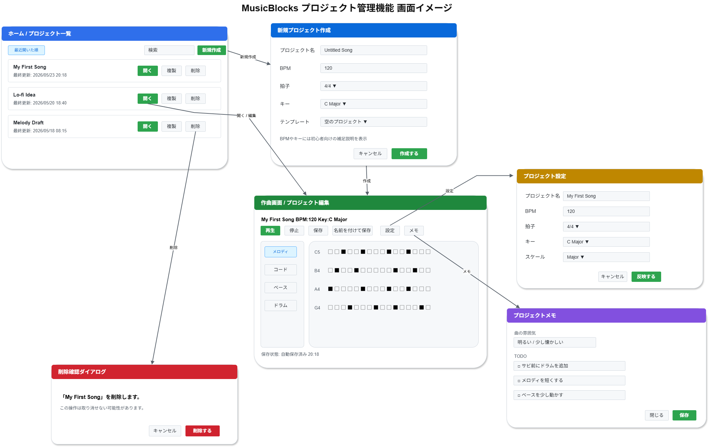
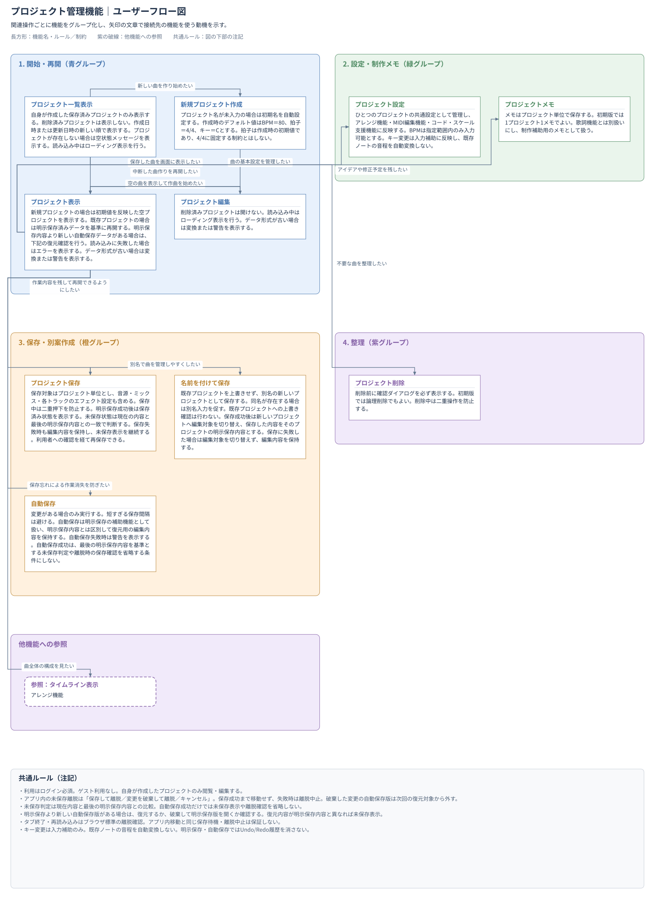

# 機能定義書:プロジェクト管理機能

[機能設計書概要へ](../Readme.md)

## 1. 機能概要

プロジェクト管理機能は、Musicflowsにおける楽曲制作単位である「プロジェクト」を作成、保存、再編集、削除するための機能群である。  
プロジェクトには、曲名、BPM、拍子、キー、トラック構成、ノート情報、音源・ミックス・エフェクト設定、制作メモなど、作曲作業を再開するために必要な情報を保持する。

本機能では、初心者が迷わず作曲を開始・中断・再開できることを重視する。

アプリの利用にはログインを必須とする。未ログイン利用・ゲスト利用は提供しない。利用者が閲覧・編集できるのは、自身が作成したプロジェクトのみとする。

- 実装機能
  - プロジェクト一覧表示
  - プロジェクト表示
  - 新規プロジェクト作成
  - プロジェクト保存
  - 名前を付けて保存
  - 自動保存
  - プロジェクト設定
  - プロジェクトメモ
  - プロジェクト編集
  - プロジェクト削除

- 今後導入予定機能
  - プロジェクト複製
  - プロジェクトテンプレート
  - 最近使ったプロジェクト
  - バージョン管理

## 2.機能別目的一覧

| No  | 機能名               | 説明                                                     | 目的                                                                                                 |
| :-- | :------------------- | :------------------------------------------------------- | :--------------------------------------------------------------------------------------------------- |
| 001 | プロジェクト一覧表示 | 保存済みプロジェクトを一覧で表示する                     | 作成済みの楽曲プロジェクトを確認し、編集・削除・再開する対象を選びやすくする                         |
| 002 | プロジェクト表示     | 空プロジェクトまたは既存プロジェクトを編集画面に表示する | 新規作成または再編集の対象となるプロジェクト情報を画面に反映し、作曲作業を開始・再開できるようにする |
| 003 | 新規プロジェクト作成 | 楽曲制作単位のプロジェクトを作成する                     | 作曲開始の入口を用意し、初心者が迷わず制作を始められるようにする                                     |
| 004 | 名前を付けて保存     | 別名でプロジェクトを保存する | プロジェクトを管理しやすくするため |
| 005 | 自動保存             | 一定時間ごと、または編集操作後に自動で保存する           | 保存忘れやブラウザ終了による作業消失を防ぐ                                                           |
| 006 | プロジェクト設定     | BPM、拍子、キー、サンプルレートなどをプロジェクト共通の設定として管理する | 楽曲制作に必要な基本設定をプロジェクト単位で管理する                                                 |
| 007 | プロジェクトメモ     | 制作メモ、歌詞案、TODOなどを記録する                     | 作曲中のアイデアや修正予定をプロジェクトに紐づけて残す                                               |
| 008 | プロジェクト編集     | 保存済みの既存プロジェクトを開いて編集する               | 中断した作曲作業を再開し、楽曲を継続的に制作できるようにする                                         |
| 009 | プロジェクト削除     | 保存済みプロジェクトを削除する                           | 不要なプロジェクトを整理し、一覧を管理しやすくする                                                   |
| 010 | プロジェクト保存     | 編集中のプロジェクト状態を保存する                       | 作成中の楽曲データを失わず、後から作業を再開できるようにする                                         |

## 3. 機能別利用シーン

| 機能名               | 利用シーン                                                                                               |
| :------------------- | :------------------------------------------------------------------------------------------------------- |
| プロジェクト一覧表示 | 保存済みの曲を探したいとき、過去に作成したプロジェクトを開きたいとき、不要なプロジェクトを整理したいとき |
| プロジェクト表示     | 新規プロジェクト作成後に空の編集画面を開くとき、保存済みプロジェクトを読み込んで続きを編集したいとき     |
| 新規プロジェクト作成 | 初めて曲を作るとき、新しいアイデアを試したいとき、空の状態から作曲を開始したいとき                       |
| プロジェクト保存     | 作曲作業を中断するとき、一定量の編集内容を確定したいとき、ブラウザを閉じる前に内容を残したいとき         |
| 名前を付けて保存     | 現在の曲を残したまま別パターンを試したいとき、アレンジ違いを作りたいとき                                 |
| 自動保存             | ユーザーが保存を忘れたとき、長時間作業しているとき、ブラウザの誤終了に備えたいとき                       |
| プロジェクト設定     | 曲のテンポやキーを変更したいとき、スケール補助や再生設定に影響する基本情報を調整したいとき               |
| プロジェクトメモ     | 作曲中に思いついたアイデア、TODO、曲の方向性、修正予定を残したいとき                                     |
| プロジェクト編集     | 保存済みプロジェクトを開いて続きを作りたいとき、過去のアイデアを再編集したいとき                         |
| プロジェクト削除     | 不要なプロジェクトやテスト作成したプロジェクトを整理したいとき                                           |

## 4. 各機能画面イメージ

画面イメージは参考図とする。画面の構成や表示項目が本文と異なる場合は、機能設計書本文を正とする。

<!-- drawio.pngで記載-->

## 5. ルール・制約

| 機能名               | ルール・制約                                                                                                                                                                                                             |
| :------------------- | :----------------------------------------------------------------------------------------------------------------------------------------------------------------------------------------------------------------------- |
| プロジェクト一覧表示 | 自身が作成した保存済みプロジェクトのみ表示する。削除済みプロジェクトは表示しない。作成日時または更新日時の新しい順で表示する。プロジェクトが存在しない場合は空状態メッセージを表示する。読み込み中はローディング表示を行う。 |
| プロジェクト表示     | 新規プロジェクトの場合は初期値を反映した空プロジェクトを表示する。既存プロジェクトの場合は明示保存済みデータを基準に再開する。明示保存内容より新しい自動保存データがある場合は、下記の復元確認を行う。読み込みに失敗した場合はエラーを表示する。データ形式が古い場合は変換または警告を表示する。 |
| 新規プロジェクト作成 | プロジェクト名が未入力の場合は初期名を自動設定する。作成時のデフォルト値はBPM＝80、拍子＝4/4、キー＝Cとする。拍子は作成時の初期値であり、4/4に固定する制約とはしない。 |
| プロジェクト保存     | 保存対象はプロジェクト単位とし、音源・ミックス・各トラックのエフェクト設定も含める。保存中は二重押下を防止する。明示保存成功後は保存済み状態を表示する。未保存状態は現在の内容と最後の明示保存内容との一致で判断する。保存失敗時も編集内容を保持し、未保存表示を継続する。利用者への確認を経て再保存できる。 |
| 名前を付けて保存     | 既存プロジェクトを上書きせず、別名の新しいプロジェクトとして保存する。同名が存在する場合は別名入力を促す。既存プロジェクトへの上書き確認は行わない。保存成功後は新しいプロジェクトへ編集対象を切り替え、保存した内容をそのプロジェクトの明示保存内容とする。保存に失敗した場合は編集対象を切り替えず、編集内容を保持する。 |
| 自動保存             | 変更がある場合のみ実行する。短すぎる保存間隔は避ける。自動保存は明示保存の補助機能として扱い、明示保存内容とは区別して復元用の編集内容を保持する。自動保存失敗時は警告を表示する。自動保存成功は、最後の明示保存内容を基準とする未保存判定や離脱時の保存確認を省略する条件にしない。 |
| プロジェクト設定     | ひとつのプロジェクトの共通設定として管理し、アレンジ機能・MIDI編集機能・コード・スケール支援機能に反映する。BPMは指定範囲内のみ入力可能とする。キー変更は入力補助に反映し、既存ノートの音程を自動変換しない。 |
| プロジェクトメモ     | メモはプロジェクト単位で保存する。初期版では1プロジェクト1メモでよい。歌詞機能とは別扱いにし、制作補助用のメモとして扱う。                                                                                               |
| プロジェクト編集     | 削除済みプロジェクトは開けない。読み込み中はローディング表示を行う。データ形式が古い場合は変換または警告を表示する。                                                                                                     |
| プロジェクト削除     | 削除前に確認ダイアログを必ず表示する。初期版では論理削除でもよい。削除中は二重操作を防止する。                                                                                                                           |

**保存状態と離脱時の共通ルール**

- 明示保存後に編集を行った場合は未保存状態とする。Undo/Redoで最後の明示保存内容と一致した場合は保存済み状態に戻す。自動保存の成功だけでは、明示保存を基準とする未保存状態を解除しない。
- エフェクトなどの設定画面を閉じても、編集中の変更を維持する。画面を閉じる操作自体ではプロジェクト保存を行わない。
- アプリ内でプロジェクトの編集画面から離脱する際に未保存の変更がある場合は、保存を促す確認を行う。自動保存済みであっても、この確認の省略条件にはしない。
- 離脱確認は「保存して離脱」「変更を破棄して離脱」「キャンセル」の3択とする。「変更を破棄して離脱」では、最後の明示保存後の編集を破棄し、その変更の自動保存データも次回の復元対象から外す。「キャンセル」では編集内容を保持して編集画面に留まる。
- 離脱時に利用者が保存を選択した場合は、保存成功まで移動しない。保存失敗時は離脱を中止し、編集内容を保持して未保存表示を継続する。再保存は利用者への確認を経て行う。
- タブ終了・再読み込みではブラウザ標準の離脱確認を使用する。ブラウザ側の制約があるため、アプリ内移動と同じ保存待機・離脱中止は保証対象に含めない。
- 明示保存・自動保存はUndo/Redo履歴を消さない。Undo/Redoの対象と操作単位は、[表示・UI支援機能](../表示・UI支援/Readme.md)の共通ルールに従う。

**自動保存データからの再開**

- 明示保存内容より新しい自動保存データがある場合は、「自動保存版を復元する」「自動保存版を破棄して明示保存版を開く」を利用者に確認する。
- 復元を選んだ場合は自動保存内容を編集中の内容として開く。最後の明示保存内容は変更せず、復元内容が明示保存内容と異なる場合は未保存状態とする。
- 破棄を選んだ場合は自動保存版を復元対象から外し、明示保存内容を開く。未保存変更はない状態とする。
- 明示保存を基準にした未保存判定と、復旧のための自動保存は別の役割として扱う。

## ユーザーフロー図

