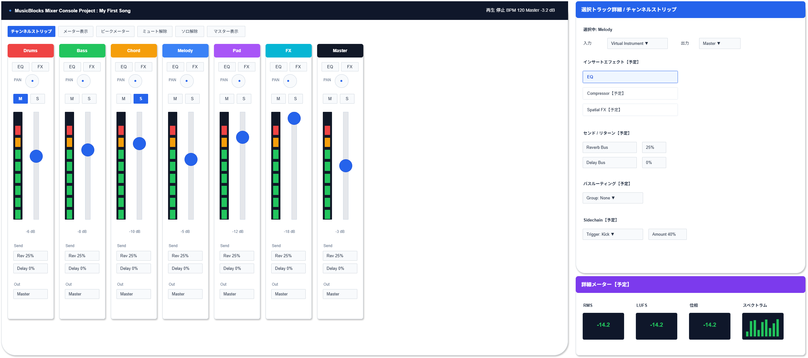

# 機能定義書:ミキサー機能

[機能設計書概要へ](../Readme.md)

## 1. 機能概要

ミキサー機能は、Musicflowsで作成した複数トラックの音量、左右定位、ミュート、ソロ、メーター表示などを管理し、曲全体の聴こえ方を整えるための機能群である。

初心者向けの初期版では、一般的なDAWの複雑なルーティングや詳細メーターを前面に出さず、まずは「各トラックの音量を調整する」「左右の位置を調整する」「一時的に消す・単独で聴く」「音量レベルを確認する」といった基本操作を優先する。

入力選択、出力選択、センド、リターン、インサートエフェクト、バスルーティング、サイドチェイン、RMS / LUFS / 位相 / スペクトラム表示は、基本作曲フローが完成した後に拡張する将来候補とする。録音機能を今回のスコープから外す方針に合わせ、録音待機は対象外とする。

- 実装機能
  - ボリュームフェーダー
  - パン
  - ミュート
  - ソロ
  - メーター表示
  - チャンネルストリップ
  - ピークメーター

- 今後導入予定機能
  - 入力選択
  - 出力選択
  - センド
  - リターン
  - インサートエフェクト
  - バスルーティング
  - サイドチェイン
  - RMSメーター
  - LUFSメーター
  - 位相メーター
  - スペクトラム表示

## 2.機能別目的一覧

| 機能名               | 説明                                   | 目的                                                         |
| :------------------- | :------------------------------------- | :----------------------------------------------------------- |
| チャンネルストリップ | トラックごとの音量・EQ・エフェクト管理 | トラック単位の主要操作を1箇所にまとめ、編集しやすくする      |
| ボリュームフェーダー | トラック音量調整                       | 各トラックの音量バランスを整えられるようにする               |
| パン                 | 左右定位調整                           | 音を左右に配置し、曲全体の広がりを作れるようにする           |
| ミュート             | 音を一時的に消す                       | 特定トラックを一時的に消して確認できるようにする             |
| ソロ                 | 指定トラックだけ鳴らす                 | 特定トラックだけを聴いて調整できるようにする                 |
| メーター表示         | 音量レベルを表示する                   | 音が大きすぎる、小さすぎる状態を視覚的に確認できるようにする |
| ピークメーター       | 最大音量を表示する                     | 音割れしやすいピークを確認できるようにする                   |

## 3. 機能別利用シーン

| 機能名               | 利用シーン                                                               |
| :------------------- | :----------------------------------------------------------------------- |
| チャンネルストリップ | トラックごとの音量、パン、EQ、エフェクトをまとめて調整したいとき         |
| ボリュームフェーダー | ドラムが大きすぎる、メロディが小さすぎるなど、音量バランスを整えたいとき |
| パン                 | メロディは中央、伴奏は左右に広げるなど、定位を調整したいとき             |
| ミュート             | 一時的にドラムを消してコードやメロディだけ確認したいとき                 |
| ソロ                 | ベースだけ、ドラムだけなど、特定トラックの音を集中して確認したいとき     |
| メーター表示         | 再生中に音量が適切か確認したいとき                                       |
| ピークメーター       | 音割れしそうな最大音量を確認したいとき                                   |

## 4. 各機能画面イメージ

## 5. ルール・制約

| 機能名               | ルール・制約                                                                                                               |
| :------------------- | :------------------------------------------------------------------------------------------------------------------------- |
| チャンネルストリップ | 初期版では音量、パン、ミュート、ソロ、簡易EQ、簡易エフェクトをまとめるUIとして扱う。詳細ルーティングは将来候補に分離する。 |
| ボリュームフェーダー | 音量を上げすぎると音割れするため、メーター表示やピーク表示と連動させる。                                                   |
| パン                 | 初心者向けには左右定位を視覚的に示す。極端な設定でも音が不自然にならないよう説明を付ける。                                 |
| ミュート             | ミュート状態は明確に色やアイコンで表示する。再生結果に即時反映する。                                                       |
| ソロ                 | 複数トラックのソロ指定を許可するかを仕様で統一する。ミュートとの優先関係を明確にする。                                     |
| メーター表示         | 音量レベルは色で状態を示す。緑は安全、黄は注意、赤はピーク超過などの表現を使う。                                           |
| ピークメーター       | 音割れの目安として表示する。初心者向けには「赤くなったら音量を下げる」など説明を付ける。                                   |
