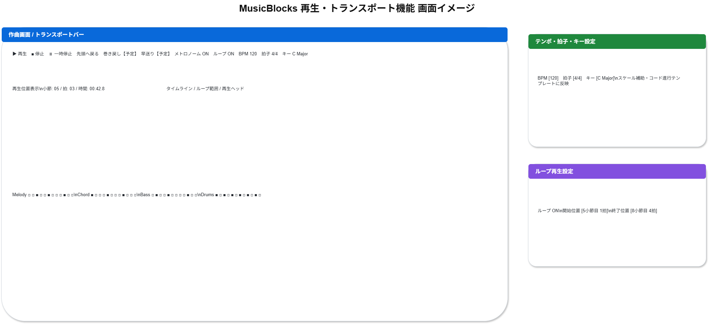

# 機能定義書:再生・トランスポート機能

[機能設計書概要へ](../Readme.md)

## 1. 機能概要

再生・トランスポート機能は、MusicBlocksで作成中の楽曲を再生・停止し、再生位置、テンポ、拍子、キーなどの基本的な再生条件を操作するための機能群である。

初心者が作曲結果をすぐに確認できることを重視し、MVPでは「再生」「停止」「一時停止」「先頭へ戻る」「メトロノーム」「ループ再生」「再生位置表示」「BPM変更」「拍子変更」「キー設定」を中心に提供する。

一方、巻き戻し・早送りは、基本作曲フロー完成後に必要性を再評価する将来候補とする。録音開始、カウントイン、パンチイン録音、パンチアウト録音は、今回の初心者向け打ち込み特化スコープから外れるため、本定義書では扱わない。

- 実装機能
  - 再生
  - 停止
  - 一時停止
  - 先頭へ戻る
  - メトロノーム
  - ループ再生
  - 再生位置表示
  - BPM変更
  - 拍子変更
  - キー設定

- 今後導入予定機能
  - 巻き戻し
  - 早送り

## 2.機能別目的一覧

| 機能名           | 説明                           | 目的                                                               |
| :--------------- | :----------------------------- | :----------------------------------------------------------------- |
| 再生             | 楽曲を再生する                 | 入力したメロディ、コード、ドラムなどをすぐに確認できるようにする   |
| 停止             | 再生を停止する                 | 再生中の楽曲を任意のタイミングで止められるようにする               |
| 一時停止         | 再生位置を維持して停止する     | 現在位置を保持したまま、確認や編集に戻れるようにする               |
| 先頭へ戻る       | 曲の先頭へ移動する             | 楽曲を最初から確認しやすくする                                     |
| 巻き戻し【予定】 | 前方向へ移動する               | 基本再生操作に慣れた後、細かい位置移動を効率化できるようにする     |
| 早送り【予定】   | 後方向へ移動する               | 基本再生操作に慣れた後、確認したい位置へ素早く移動できるようにする |
| メトロノーム     | 拍に合わせてクリック音を鳴らす | リズムや拍を意識しながら入力・確認できるようにする                 |
| ループ再生       | 指定範囲を繰り返す             | サビや一部フレーズなどを繰り返し確認・修正できるようにする         |
| 再生位置表示     | 小節、拍、時間を表示する       | 現在どこを再生しているかを視覚的に把握できるようにする             |
| BPM変更          | 曲のテンポを変更する           | 楽曲の速さを調整し、曲調や作りたい雰囲気に合わせられるようにする   |
| 拍子変更         | 4/4、3/4などを設定する         | 楽曲のリズム構造を設定できるようにする                             |
| キー設定         | 曲のキーを設定する             | スケール補助やコード進行テンプレートの基準を決められるようにする   |

## 3. 機能別利用シーン

| 機能名           | 利用シーン                                                 |
| :--------------- | :--------------------------------------------------------- |
| 再生             | 作成したメロディやリズムを音として確認したいとき           |
| 停止             | 再生を終了して編集作業に戻りたいとき                       |
| 一時停止         | 現在位置を保持したまま一旦止め、同じ位置から再開したいとき |
| 先頭へ戻る       | 曲全体を最初から聴き直したいとき                           |
| 巻き戻し【予定】 | 少し前の小節やフレーズをもう一度確認したいとき             |
| 早送り【予定】   | サビや後半部分など、先の位置へ素早く移動したいとき         |
| メトロノーム     | リズムの基準を聴きながら音を配置したいとき                 |
| ループ再生       | 特定区間だけを繰り返し聴いて調整したいとき                 |
| 再生位置表示     | 今どの小節・拍・時間を再生しているか確認したいとき         |
| BPM変更          | 曲を速くしたい、遅くしたい、雰囲気を変えたいとき           |
| 拍子変更         | 4拍子以外のリズムで曲を作りたいとき                        |
| キー設定         | コード進行やスケール補助を曲のキーに合わせたいとき         |

## 4. 各機能画面イメージ

## 5. ルール・制約

| 機能名           | ルール・制約                                                                                                         |
| :--------------- | :------------------------------------------------------------------------------------------------------------------- |
| 再生             | ブラウザの自動再生制限により、初回再生はユーザー操作を起点にする。再生中は再生位置をUIに反映する。                   |
| 停止             | 停止時は再生状態を解除し、必要に応じて再生位置を先頭または現在位置に戻す仕様を明確にする。                           |
| 一時停止         | 一時停止時は現在の再生位置を保持する。再開時は保持した位置から再生する。                                             |
| 先頭へ戻る       | 再生中に押した場合は先頭へ移動して継続再生するか、一度停止するかを仕様で統一する。                                   |
| 巻き戻し【予定】 | 初期MVPでは対象外とし、将来実装時は移動単位を小節単位または拍単位に限定する。                                        |
| 早送り【予定】   | 初期MVPでは対象外とし、将来実装時は移動先が曲の終端を超えないよう制御する。                                          |
| メトロノーム     | ON/OFF切替可能とする。初期状態はOFFでもよいが、入力支援として目立つ位置に配置する。                                  |
| ループ再生       | ループ範囲の開始位置と終了位置を明確に表示する。範囲未設定時は通常再生とする。                                       |
| 再生位置表示     | 小節・拍・時間のうち、初心者が理解しやすい形式を優先表示する。必要に応じて詳細表示に切り替える。                     |
| BPM変更          | 指定可能な範囲を設ける。再生中に変更した場合、即時反映するか次回再生から反映するかを仕様で統一する。                 |
| 拍子変更         | 初期版では4/4を基本とし、3/4などの対応は段階的に拡張してもよい。変更時はグリッド表示に反映する。                     |
| キー設定         | スケール補助、コード進行テンプレート、入力候補の基準として使用する。既存ノートの自動変換は初期版では対象外でもよい。 |
