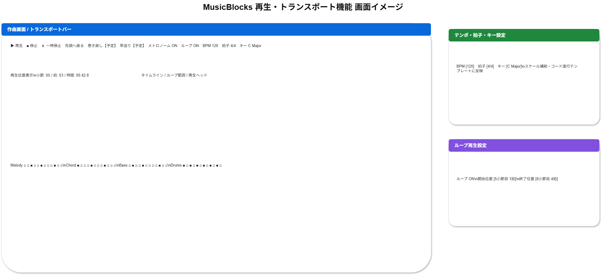
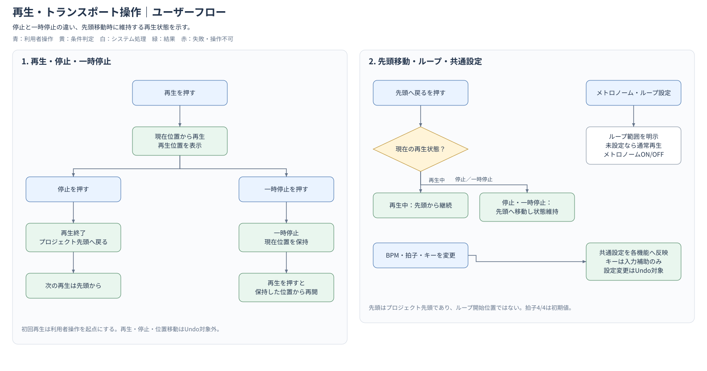

# 機能定義書:再生・トランスポート機能

[機能設計書概要へ](../Readme.md)

## 1. 機能概要

再生・トランスポート機能は、Musicflowsで作成中の楽曲を再生・停止し、再生位置、テンポ、拍子、キーなどの基本的な再生条件を操作するための機能群である。

初心者が作曲結果をすぐに確認できることを重視し、MVPでは「再生」「停止」「一時停止」「先頭へ戻る」「メトロノーム」「ループ再生」「再生位置表示」を中心に提供する。

一方、巻き戻し・早送りは、基本作曲フロー完成後に必要性を再評価する将来候補とする。録音開始、カウントイン、パンチイン録音、パンチアウト録音は、今回の初心者向け打ち込み特化スコープから外れるため、本定義書では扱わない。

- 実装機能
  - 再生
  - 停止
  - 一時停止
  - 先頭へ戻る
  - メトロノーム
  - ループ再生
  - 再生位置表示
  - BPM変更
  - 拍子変更
  - キー設定

- 今後導入予定機能
  - 巻き戻し
  - 早送り

## 2.機能別目的一覧

| 機能名       | 説明                           | 目的                                                             |
| :----------- | :----------------------------- | :--------------------------------------------------------------- |
| 再生         | 楽曲を再生する                 | 入力したメロディ、コード、ドラムなどをすぐに確認できるようにする |
| 停止         | 再生を終了し、曲の先頭へ戻す | 再生を終了して曲全体を聴き直せるようにする |
| 一時停止     | 再生位置を維持して停止する     | 現在位置を保持したまま、確認や編集に戻れるようにする             |
| 先頭へ戻る   | 曲の先頭へ移動する             | 楽曲を最初から確認しやすくする                                   |
| メトロノーム | 拍に合わせてクリック音を鳴らす | リズムや拍を意識しながら入力・確認できるようにする               |
| ループ再生   | 指定範囲を繰り返す             | サビや一部フレーズなどを繰り返し確認・修正できるようにする       |
| 再生位置表示 | 小節、拍、時間を表示する       | 現在どこを再生しているかを視覚的に把握できるようにする           |

## 3. 機能別利用シーン

| 機能名       | 利用シーン                                                 |
| :----------- | :--------------------------------------------------------- |
| 再生         | 作成したメロディやリズムを音として確認したいとき           |
| 停止         | 再生を終了して曲の先頭へ戻したいとき |
| 一時停止     | 現在位置を保持したまま一旦止め、同じ位置から再開したいとき |
| 先頭へ戻る   | 曲全体を最初から聴き直したいとき                           |
| メトロノーム | リズムの基準を聴きながら音を配置したいとき                 |
| ループ再生   | 特定区間だけを繰り返し聴いて調整したいとき                 |
| 再生位置表示 | 今どの小節・拍・時間を再生しているか確認したいとき         |

## 4. 各機能画面イメージ

画面イメージは参考図とする。画面の構成や表示項目が本文と異なる場合は、機能設計書本文を正とする。

## 5. ルール・制約

BPM・拍子・キーは、プロジェクト管理の共通設定と同じ値を扱う。作成時のデフォルト値はBPM＝80、拍子＝4/4、キー＝Cとする。設定変更はアレンジ機能・MIDI編集機能・コード・スケール支援機能へ反映する。キー変更は入力補助だけに反映し、既存ノートの音程を自動変換しない。BPM・拍子・キーの変更はUndo/Redo対象とし、再生・停止・一時停止・再生位置移動は対象外とする。

| 機能名           | ルール・制約                                                                                       |
| :--------------- | :------------------------------------------------------------------------------------------------- |
| 再生             | ブラウザの自動再生制限により、初回再生はユーザー操作を起点にする。再生中は再生位置をUIに反映する。 |
| 停止             | 再生を終了し、再生位置を曲全体の先頭へ戻す。次の再生は先頭から開始する。現在位置を保持したい場合は一時停止を使用する。 |
| 一時停止         | 一時停止時は現在の再生位置を保持する。再開時は保持した位置から再生する。                           |
| 先頭へ戻る       | 曲全体の先頭へ移動する。再生中は先頭から再生を継続し、停止中・一時停止中はそれぞれの状態を維持する。先頭はループ範囲の開始位置とは区別する。 |
| 巻き戻し【予定】 | 初期MVPでは対象外とし、将来実装時は移動単位を小節単位または拍単位に限定する。                      |
| メトロノーム     | ON/OFF切替可能とする。初期状態はOFFでもよいが、入力支援として目立つ位置に配置する。                |
| ループ再生       | ループ範囲の開始位置と終了位置を明確に表示する。範囲未設定時は通常再生とする。                     |
| 再生位置表示     | 小節・拍・時間のうち、初心者が理解しやすい形式を優先表示する。必要に応じて詳細表示に切り替える。   |

## ユーザーフロー図

