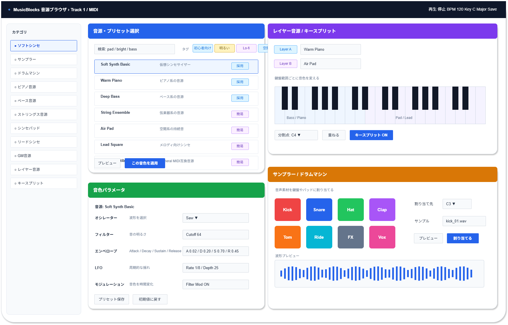

# 機能定義書:楽器・音源機能

[機能設計書概要へ](../Readme.md)

## 1. 機能概要

楽器・音源機能は、Musicflowsで作成する各トラックに対して、音色や音源を選択・調整するための機能群である。  
初心者が作曲を始める際に「どの音を使えばよいか」で迷わないように、ソフトシンセ、ドラムマシン、ピアノ音源、ベース音源などの基本音源を中心に提供する。

また、一般的なDAWに存在する高度な音源編集機能はそのまま前面に出さず、プリセット選択を中心にしつつ、必要に応じてオシレーター、フィルター、エンベロープ、LFO、モジュレーションなどを簡易設定として扱う。  
サンプラー、ストリングス音源、シンセパッド、リードシンセ、GM音源、レイヤー音源、キースプリットは、初期MVPでは複雑になりすぎないよう、用途を絞ってコンセプト化して採用する。

- 実装機能
  - ソフトシンセ
  - ドラムマシン
  - ピアノ音源
  - ベース音源
  - プリセット選択

- 今後導入予定機能
  - なし  
    ※今回の対象一覧では「将来候補」に該当する機能なし

## 2.機能別目的一覧

| 機能名           | 説明                               | 目的                                                                         |
| :--------------- | :--------------------------------- | :--------------------------------------------------------------------------- |
| ソフトシンセ     | 仮想シンセサイザー                 | メロディ、ベース、効果音などをブラウザ上で生成できるようにする               |
| サンプラー       | 音声素材を鍵盤に割り当てる         | 短い音声素材やワンショット音を演奏・配置できるようにする                     |
| ドラムマシン     | キック、スネア等を鳴らす           | ドラムパターンを初心者でも扱いやすく作成できるようにする                     |
| ピアノ音源       | ピアノ系の音源                     | メロディやコード入力に使いやすい基本音色を提供する                           |
| ベース音源       | ベース系の音源                     | 楽曲の低音パートを作成できるようにする                                       |
| ストリングス音源 | 弦楽器系の音源                     | 楽曲に厚みや壮大さを加えられるようにする                                     |
| シンセパッド     | 空間系の持続音                     | 背景感や空間的な雰囲気を作れるようにする                                     |
| リードシンセ     | メロディ向けシンセ                 | 主旋律や印象的なフレーズを作れるようにする                                   |
| GM音源           | General MIDI互換音源               | 標準的な音色セットを利用し、MIDIデータとの互換性を確保する                   |
| プリセット選択   | 音色プリセットを選ぶ               | 初心者が細かい設定をせず、目的に合う音色をすぐ選べるようにする               |
| プリセット保存   | 自作音色を保存する                 | 調整した音色を再利用できるようにする                                         |
| オシレーター設定 | 波形を選択する                     | 音色の基本となる波形を簡単に変えられるようにする                             |
| フィルター設定   | 音の明るさを調整する               | 音のこもり具合や明るさを調整できるようにする                                 |
| エンベロープ設定 | Attack / Decay / Sustain / Release | 音の立ち上がりや余韻を調整できるようにする                                   |
| LFO設定          | 周期的な揺れを作る                 | 音に揺れや動きを加えられるようにする                                         |
| モジュレーション | パラメータを動的に変化させる       | 音色に時間変化や表現を加えられるようにする                                   |
| レイヤー音源     | 複数音色を重ねる                   | 2つ以上の音色を重ねて厚みのある音を作れるようにする                          |
| キースプリット   | 鍵盤範囲ごとに音色を変える         | 低音域はベース、高音域はリードなど、範囲ごとに音色を使い分けられるようにする |

## 3. 機能別利用シーン

| 機能名           | 利用シーン                                                       |
| :--------------- | :--------------------------------------------------------------- |
| ソフトシンセ     | メロディ、ベース、効果音などを自由に作りたいとき                 |
| サンプラー       | ドラム素材、効果音、短い音声素材を鍵盤やパッドに割り当てたいとき |
| ドラムマシン     | キック、スネア、ハイハットなどでリズムを作りたいとき             |
| ピアノ音源       | コード進行やメロディを自然なピアノ音で確認したいとき             |
| ベース音源       | ベースラインを作成し、曲の土台を作りたいとき                     |
| ストリングス音源 | サビや盛り上がる部分に厚みを加えたいとき                         |
| シンセパッド     | 背景に広がる持続音を入れて雰囲気を作りたいとき                   |
| リードシンセ     | 主旋律や印象的なメロディラインを作りたいとき                     |
| GM音源           | 標準的なMIDI音色で再生確認したいとき                             |
| プリセット選択   | 細かい音作りをせず、目的に合う音をすぐ選びたいとき               |
| プリセット保存   | 調整した音色を後から再利用したいとき                             |
| オシレーター設定 | 音の基本キャラクターを変えたいとき                               |
| フィルター設定   | 音を明るくしたい、こもらせたい、柔らかくしたいとき               |
| エンベロープ設定 | 音の立ち上がりや余韻を調整したいとき                             |
| LFO設定          | 音に周期的な揺れや動きを加えたいとき                             |
| モジュレーション | 時間変化する音色表現を作りたいとき                               |
| レイヤー音源     | ピアノとパッドなど複数音色を重ねて厚みを出したいとき             |
| キースプリット   | 鍵盤の低音域と高音域で別の音色を使いたいとき                     |

## 4. 各機能画面イメージ

## 5. ルール・制約

| 機能名           | ルール・制約                                                                                                         |
| :--------------- | :------------------------------------------------------------------------------------------------------------------- |
| ソフトシンセ     | 初期版ではプリセット中心で提供し、細かいシンセ設計は詳細設定として扱う。ブラウザで安定して鳴る軽量な音源を優先する。 |
| サンプラー       | 読み込める音声形式や容量に上限を設ける。初期版では短いワンショット素材を中心に扱う。                                 |
| ドラムマシン     | キック、スネア、ハイハットなど基本的なドラム音を優先する。ステップシーケンサーと連携しやすい構成にする。             |
| ピアノ音源       | 初心者向けの標準音色として扱う。音源選択に迷った場合のデフォルト候補にする。                                         |
| ベース音源       | 低音域で破綻しにくい音色を中心に提供する。音量が大きくなりすぎないよう初期値を調整する。                             |
| ストリングス音源 | 初期版では少数のプリセットに限定する。細かい奏法切替は対象外でもよい。                                               |
| シンセパッド     | 長く鳴る音色のため、音の重なりやCPU負荷に注意する。音量初期値を控えめにする。                                        |
| リードシンセ     | メロディ用途として使いやすいプリセットを中心にする。過度に尖った音色は初期候補から外してもよい。                     |
| GM音源           | General MIDI互換を意識するが、完全互換よりも初心者が扱いやすい音色分類を優先する。                                   |
| プリセット選択   | 音色数を増やしすぎると迷うため、カテゴリ・タグ・検索で絞り込めるようにする。                                         |
| プリセット保存   | 保存名が未入力の場合は自動名を付与する。保存済みプリセットと標準プリセットを区別する。                               |
| オシレーター設定 | 初期版では波形選択を中心にし、複雑なシンセ構成は詳細設定に回す。                                                     |
| フィルター設定   | カットオフなど最低限の項目に絞る。初心者向けには「明るい」「柔らかい」などの表現も併記する。                         |
| エンベロープ設定 | ADSRは専門用語になりやすいため、ツールチップや説明を表示する。                                                       |
| LFO設定          | 初期版ではプリセットまたは簡易スライダーで扱う。過度な揺れにならないよう上限を設ける。                               |
| モジュレーション | 複雑な割り当ては初期版では避け、代表的な変化だけを提供する。                                                         |
| レイヤー音源     | 音量が大きくなりすぎないよう自動でバランスを調整する。重ねる音色数に上限を設ける。                                   |
| キースプリット   | 分割点をわかりやすく表示する。範囲が重複する場合の発音ルールを定義する。                                             |
