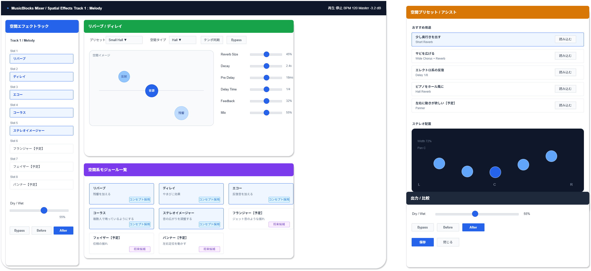

# 機能定義書:空間系機能

[機能設計書概要へ](../Readme.md)

## 1. 機能概要

空間系機能は、Musicflowsで作成した各トラックに対して、残響、反復音、広がり、定位の変化を加えるための機能群である。  
音そのものを大きく変えるというより、音が鳴っている場所・広がり・奥行きを調整し、楽曲の雰囲気を作ることを目的とする。

初心者向けの初期版では、専門的なパラメータを細かく操作させるのではなく、「少し奥行きを出す」「サビを広げる」「やまびこ感を出す」など、目的ベースのプリセットや簡易操作を中心に提供する。  
フランジャー、フェイザー、パンナーは演出性が高く、初期作曲フローでは優先度が下がるため、将来候補として扱う。

- 実装機能
  - リバーブ
  - ディレイ
  - エコー
  - コーラス
  - ステレオイメージャー

- 今後導入予定機能
  - フランジャー
  - フェイザー
  - パンナー

## 2.機能別目的一覧

| 機能名               | 説明                         | 目的                                                               |
| :------------------- | :--------------------------- | :----------------------------------------------------------------- |
| リバーブ             | 残響を加える                 | 音に奥行きや空間感を加え、自然な響きを作れるようにする             |
| ディレイ             | やまびこ効果                 | 音を時間差で繰り返し、リズム感や広がりを作れるようにする           |
| エコー               | 反復音を加える               | 音の繰り返しによる余韻や演出を加えられるようにする                 |
| コーラス             | 複数人で鳴っているようにする | 音に厚みや広がりを加え、単調さを減らせるようにする                 |
| フランジャー【予定】 | ジェット音のような揺れ       | 特徴的な揺れや効果音的な変化を加えられるようにする                 |
| フェイザー【予定】   | 位相の揺れ                   | 音にうねりや動きを加えられるようにする                             |
| ステレオイメージャー | 音の広がりを調整する         | 左右の広がりを調整し、楽曲全体の空間バランスを整えられるようにする |
| パンナー【予定】     | 左右定位を動かす             | 音を左右に動かし、動きのある演出を作れるようにする                 |

## 3. 機能別利用シーン

| 機能名               | 利用シーン                                                                     |
| :------------------- | :----------------------------------------------------------------------------- |
| リバーブ             | ピアノやメロディに奥行きが欲しいとき、ホールや部屋で鳴っているようにしたいとき |
| ディレイ             | メロディやシンセにやまびこのような反復を加え、リズム感を出したいとき           |
| エコー               | 音を繰り返して余韻を出したいとき、印象的なフレーズを作りたいとき               |
| コーラス             | シンセやギター風の音に厚みを出したいとき、複数音が鳴っているようにしたいとき   |
| フランジャー【予定】 | ジェット音のような特殊な揺れを加えたいとき                                     |
| フェイザー【予定】   | 位相の揺れによるうねりを作りたいとき                                           |
| ステレオイメージャー | サビやパッド音を左右に広げ、曲全体を広く聴かせたいとき                         |
| パンナー【予定】     | 音を左右に動かして、動きのある演出を加えたいとき                               |

## 4. 各機能画面イメージ

## 5. ルール・制約

| 機能名               | ルール・制約                                                                              |
| :------------------- | :---------------------------------------------------------------------------------------- |
| リバーブ             | かけすぎると音がぼやけるため、初心者向けには控えめな初期値と用途別プリセットを用意する。  |
| ディレイ             | BPMに同期できる設定を優先する。初心者向けには1/4、1/8、1/16など拍単位で選べるようにする。 |
| エコー               | ディレイと近い機能のため、初期版ではディレイのプリセットとして扱ってもよい。              |
| コーラス             | 音の広がりを作る補助として扱う。過度に使うと音程感がぼやけるため、適用量に上限を設ける。  |
| フランジャー【予定】 | 効果が強く特殊なため、初期版では非表示または将来候補として扱う。                          |
| フェイザー【予定】   | 初心者には用途がわかりにくいため、導入時はプリセット名や説明を併記する。                  |
| ステレオイメージャー | 広げすぎると定位が不安定になるため、Before / After 比較や安全範囲を用意する。             |
| パンナー【予定】     | 自動で左右移動する場合、動きが強すぎると聴きづらくなるため、速度と幅に制限を設ける。      |
