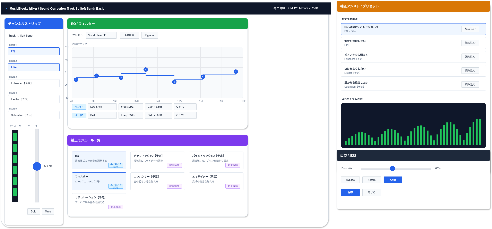

# 機能定義書:音質補正機能

[機能設計書概要へ](../Readme.md)

## 1. 機能概要

音質補正機能は、Musicflows上で作成した各トラックの音を整え、聴きやすくするための機能群である。  
初心者向けの作曲アプリであることを踏まえ、初期段階では「音を整える」「不要な低域や高域を減らす」といった目的を達成しやすい機能を優先する。

そのため、MVPでは **EQ** と **フィルター** を中心に、難しい専門操作をそのまま露出するのではなく、プリセットや目的ベースのガイドと組み合わせて扱う。  
一方で、グラフィックEQ、パラメトリックEQ、エンハンサー、エキサイター、サチュレーションは、基本作曲フローが固まった後に導入を検討する将来候補とする。

- 実装機能
  - EQ
  - フィルター

- 今後導入予定機能
  - グラフィックEQ
  - パラメトリックEQ
  - エンハンサー
  - エキサイター
  - サチュレーション

## 2.機能別目的一覧

| 機能名     | 説明                       | 目的                                                       |
| :--------- | :------------------------- | :--------------------------------------------------------- |
| EQ         | 周波数ごとの音量を調整する | こもりや痛い帯域を抑え、音のバランスを整えられるようにする |
| フィルター | ローパス、ハイパス等       | 不要な低域や高域をカットし、音を整理できるようにする       |

## 3. 機能別利用シーン

| 機能名     | 利用シーン                                                             |
| :--------- | :--------------------------------------------------------------------- |
| EQ         | ピアノやシンセが少しこもって聞こえるので、帯域バランスを整えたいとき   |
| フィルター | 低音の濁りを減らしたい、高音を丸くしたいなど、不要帯域を整理したいとき |

## 4. 各機能画面イメージ

## 5. ルール・制約

| 機能名     | ルール・制約                                                                                                  |
| :--------- | :------------------------------------------------------------------------------------------------------------ |
| EQ         | 初心者向けの初期版では、用途別プリセットや簡易プリセット名を用意し、細かい数値設定を必須にしない。            |
| フィルター | ハイパス / ローパスの基本操作を優先し、名称だけでなく「低音を減らす」「高音を丸くする」といった説明を添える。 |
