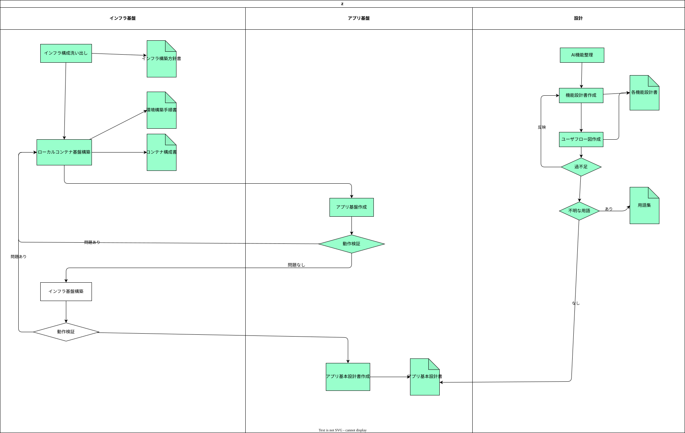

# 計画書

[Readme](../../Readme.md)

## 設計手法

今回の初回開発ではウォーターフォールを採用した

- **理由**
  - すでにあるDAWの機能の開発
  - 初回開発の機能数が多い
  - 専門知識が必要になることが多いためほかの機能との整合性を確認する必要がある

## 計画詳細

### 設計

**AI機能整理**

下記アプローチの順番で今回のアプリを実装する機能の列挙、優先度付けを行った

1. 想定ユーザの定義

- 誰向けにかをはっきりさせることで実装すべき機能、しなくてもよい機能を見つけることができる(この人はこんな考えでこんな機能を使うのだろうか)
- どういうアプリを作ればいいかの方針やコンセプトを考えやすい

2. AIによる機能列挙

- そもそも我々が作ろうとしているWebアプリはすでに先人の人が作っていることがほとんどなので自分で一から機能を列挙するよりAIに列挙してもらったほうがよい(専門性の高いアプリならなおさら)
- ある程度カテゴリーごとにグルーピングしてもらって列挙する(それぞれの機能の関係性の整理や調査がしやすい)

3. AIによる優先度をつけてもらう

- 列挙した機能に対して下記優先度をつけてもらい、その優先度にした理由も記載させる
  - 採用:ほぼそのまま機能を取り込む
  - コンセプト化して採用:コンセプトに沿った形で機能を取り込む
  - 将来候補:今回のPJである程度機能が出来上がった際に余裕があれば取り込む候補
  - 対象外:今回のPJでは取り込まない
- 優先度を決める観点もある程度AIに考えてもらい、点数化したうえで優先度をつけさせる

4. 類似するアプリとそのアプリに対して拡張、差別化できる部分をAIを使って分析する

- オリジナルを出す部分。ここを明確化しないとこのアプリを作成する意味を外部に説明できないため

**機能設計書作成**

1. AI機能整理で洗い出した機能一覧をもとに大枠の機能設計書を作成する
2. グルーピングごとの詳細の個別の機能設計書を作成する

どちらもある程度のフォーマットを統一したうえでAIに出力してもらう

**ユーザーフロー図作成**

個別の機能設計書ごとにユーザーの動機、動機に伴い使用する機能をフローとしてまとめる

- 機能間の関係性が把握しやすい
- ユーザーの動機に着目するのでUXを考慮した設計を考えやすくする
- 個別の機能で必要、不必要なものが洗い出せる

**用語集**

ユーザーフロー作成時に各機能設計書で専門的な用語が出てきた場合は用語集としてまとめる

- 基本設計書以降のフェーズで用語の使い方に矛盾をなくす
- ユーザー側で専門用語をどう示すかの重要なインプット情報
