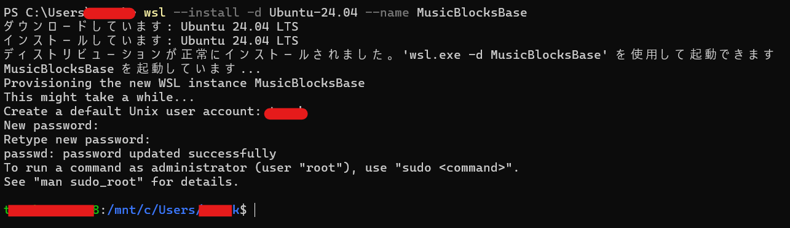
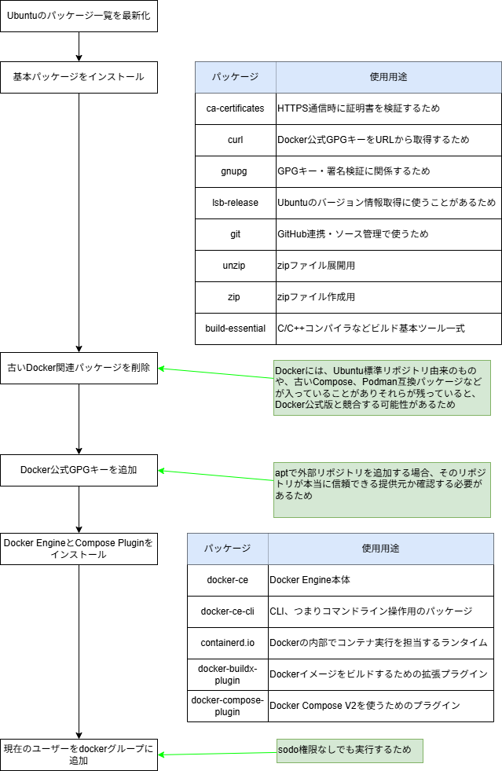
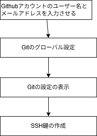
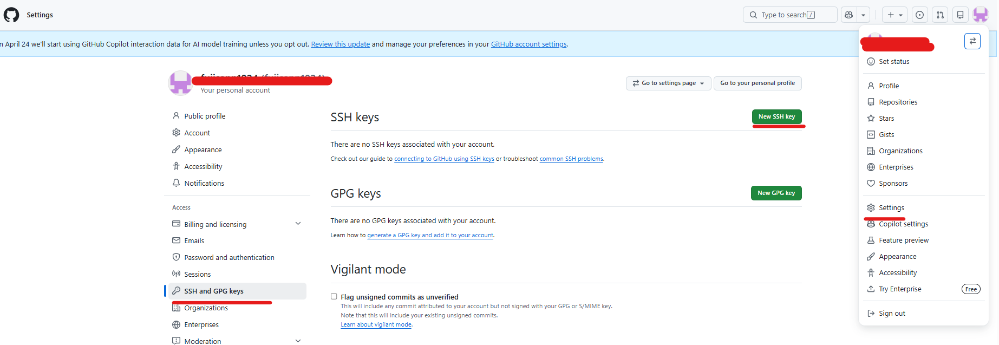
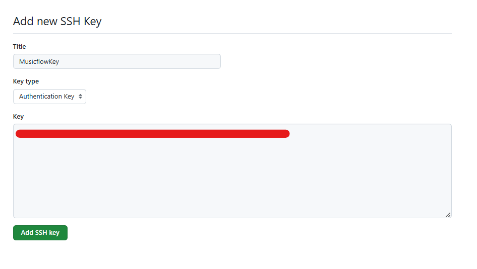
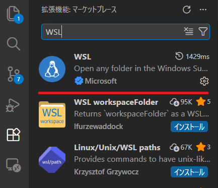
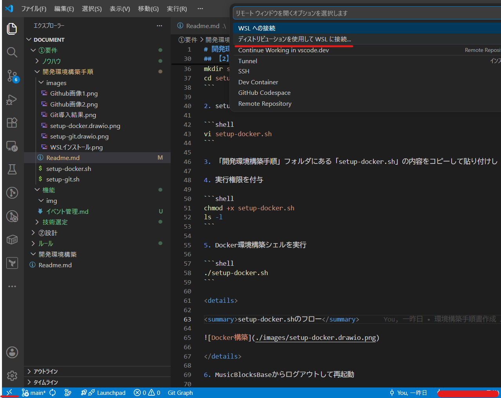
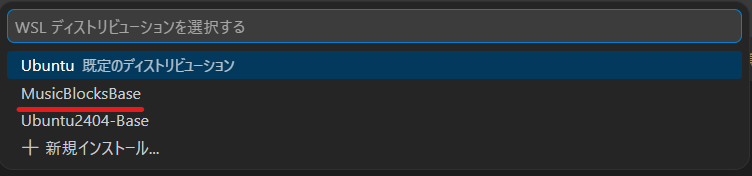
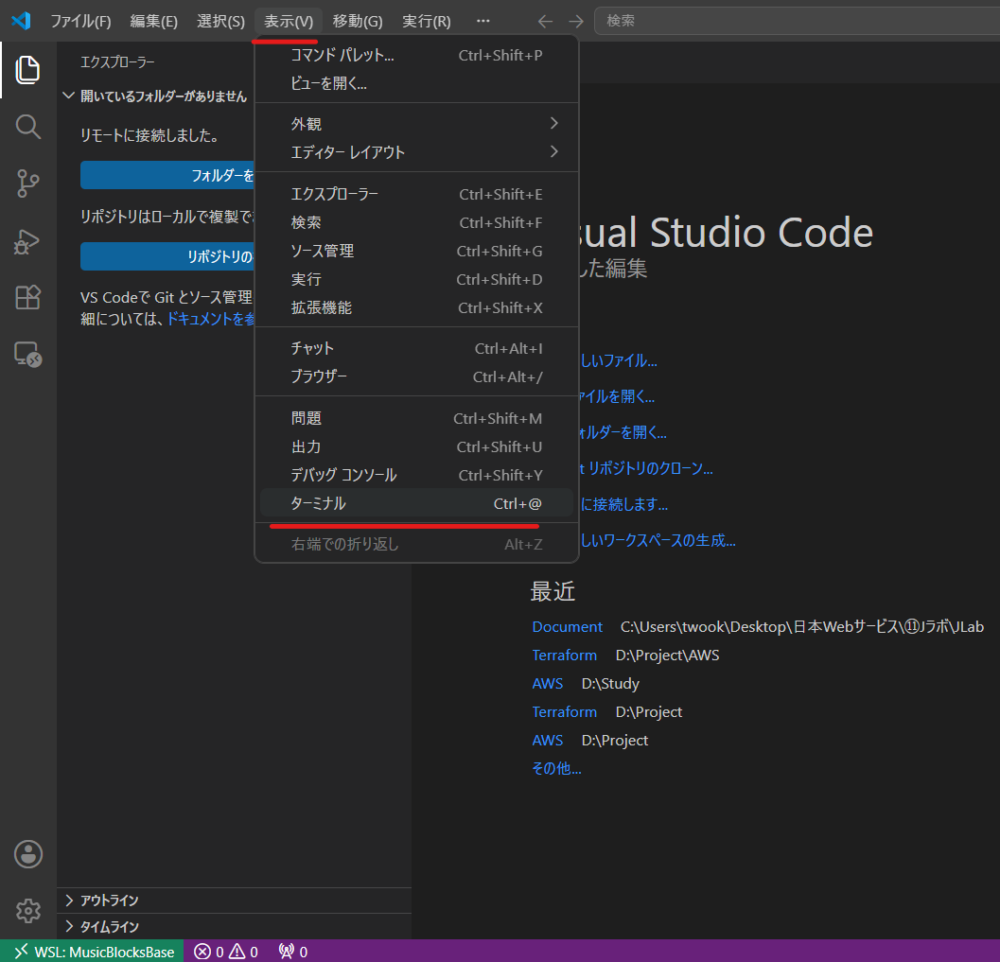

# 開発環境構築手順

## 前提

- 端末のOSはWindows11(Ubuntuをインストールできる環境さえあればよい)
- Githubアカウントを持っていること
- VSCodeはインストール済み

## 【1】WSLの構築

1. Windows PowerShellを開き、下記コマンドを実行。

```shell
wsl --install -d Ubuntu-24.04 --name MusicBlocksBase
```

2. 実行後はユーザー名とパスワードを設定する



コマンド一覧

| 使用用途                    | コマンド               |
| :-------------------------- | :--------------------- |
| WSL上のUbuntuから抜ける     | exit                   |
| WSLの状態とバージョンを見る | wsl -l -v              |
| 指定のWSLを停止             | wsl -t MusicBlocksBase |
| 　指定のWSLを起動           | wsl -d MusicBlocksBase |

## 【2】Dockerの導入

1. 実行用のフォルダを/home/ユーザー名配下に作成

```shell
cd ~
mkdir setup
cd setup
```

2. setup-docker.shを作成

```shell
vi setup-docker.sh
```

3. 「開発環境構築手順」フォルダにある「setup-docker.sh」の内容をコピーして貼り付けし「:wq」で保存

4. 実行権限を付与

```shell
chmod +x setup-docker.sh
ls -l
```

5. Docker環境構築シェルを実行

```shell
./setup-docker.sh
```

<details>

<summary>setup-docker.shのフロー</summary>



</details>

6. MusicBlocksBaseからログアウトして再起動

```shell
exit
wsl -t MusicBlocksBase
wsl -l -v
wsl -d MusicBlocksBase
```

## 【3】Gitの導入

1. setupフォルダに移動

```shell
cd ~/setup
```

2. setup-git.shを作成

```shell
vi setup-git.sh
```

3. 「開発環境構築手順」フォルダにある「setup-git.sh」の内容をコピーして貼り付けし「:wq」で保存

4. 実行権限を付与

```shell
chmod +x setup-git.sh
ls -l
```

5. Git環境構築シェルを実行、「user.name」「user.email」にそれぞれGithubアカウントのユーザー名とemailアドレスを設定。それ以降はEnterでよい

```shell
./setup-git.sh
```

<details>

<summary>setup-git.shのフロー</summary>



</details>

6. 実行後に表示されている公開鍵をコピー※「ssh-ed25519 XXXX」

7. Githubアカウントのアカウントアイコンを右クリック→「Settings」→「SSH and GPG keys」→「New SSH key」



8. titleと6でコピーしたSSHキーを入力



9. 下記接続確認コマンドを実行

```shell
ssh -T git@github.com
```

下記内容が表示されていればOK

「Hi ユーザー名! You've successfully authenticated～.」

## 【4】WSL連携

1. VSCodeの拡張機能からWSLをインストール



2. 「><」→「ディストリビューションを使用してWSLに接続」



3. MusicBlocksBaseを選択



4. 「表示」→「ターミナル」でコマンド操作可能


