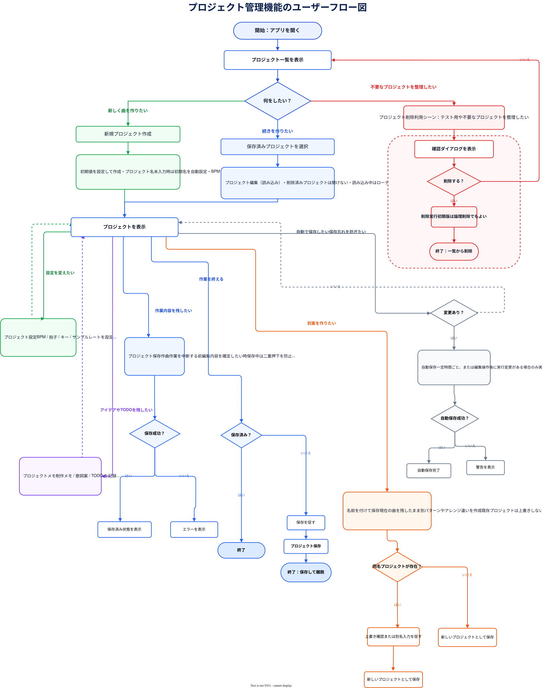
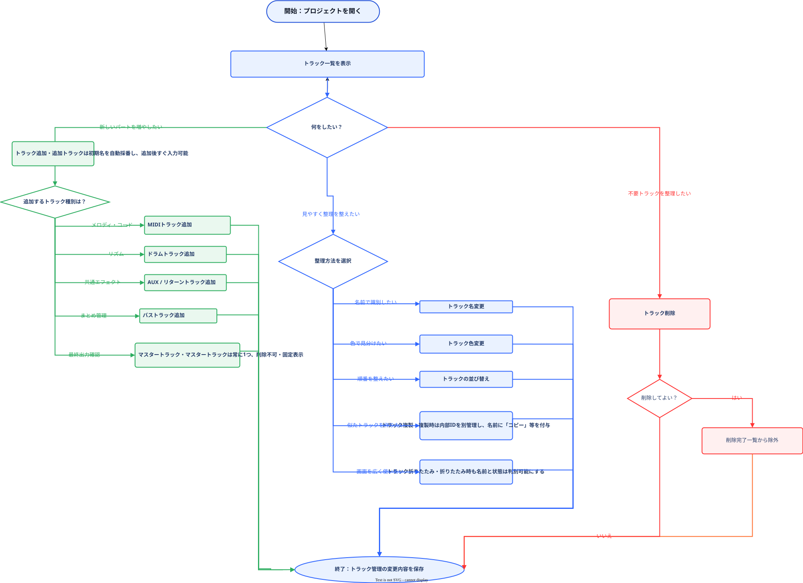
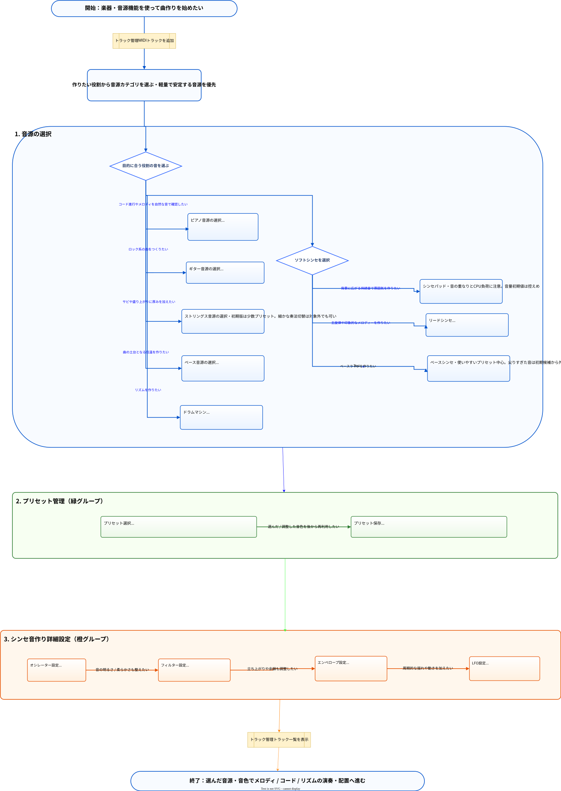
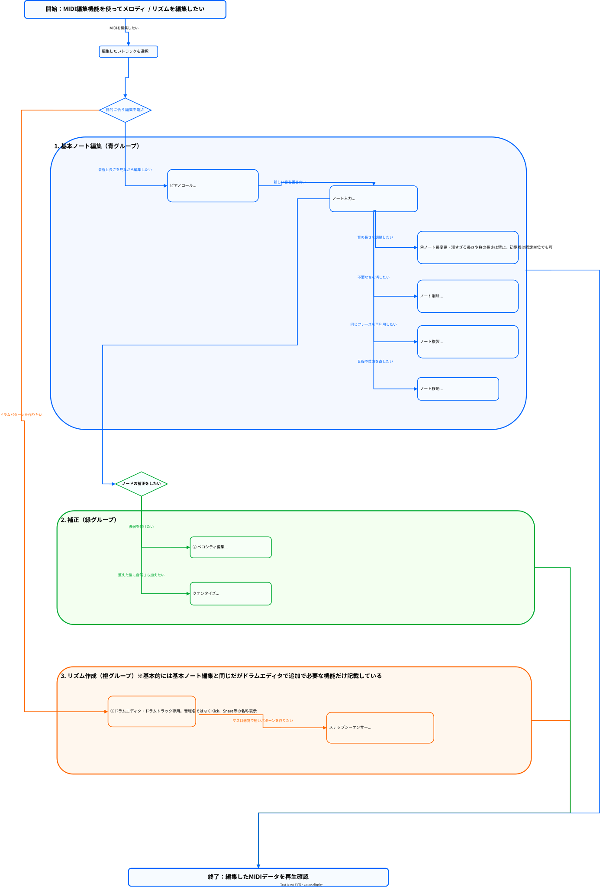

## 作成方針

- 機能設計書で記載した内容をもとにAIにユーザフロー図を作成させる。画面遷移図やデータモデルの作成元となる
- 長方形：操作(制約があればそれも記載)
- 矢印：操作の流れ(ユーザが行う操作の動機も記載)
- 関連する操作ごとに色でグルーピング

## 制約

- 画面、データという用語は使用しない。あくまで着目するのは操作とそれにいたる動機

## プロジェクト管理機能

## トラック管理

## 楽器・音源機能

## MIDI編集

